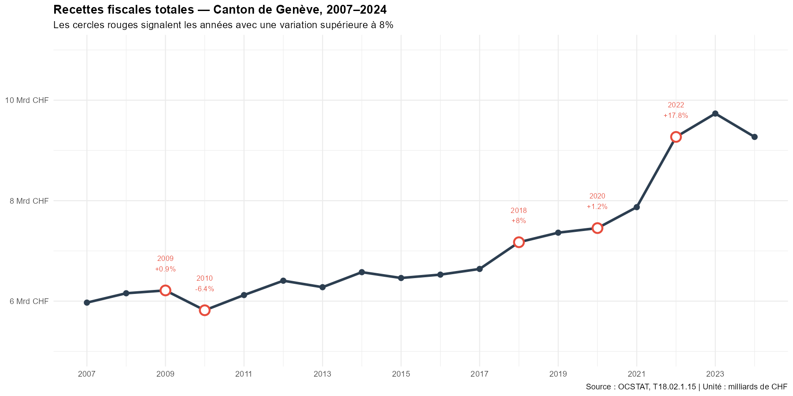
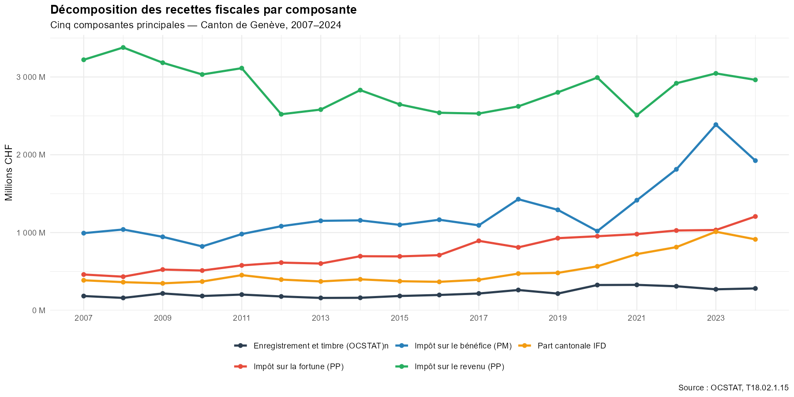
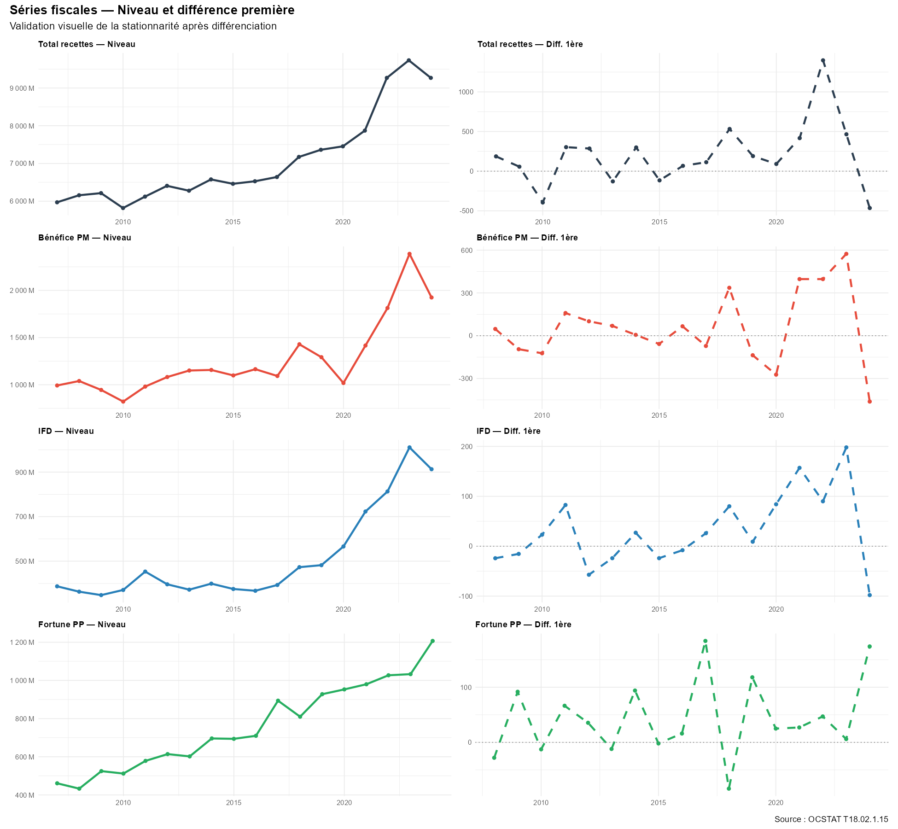
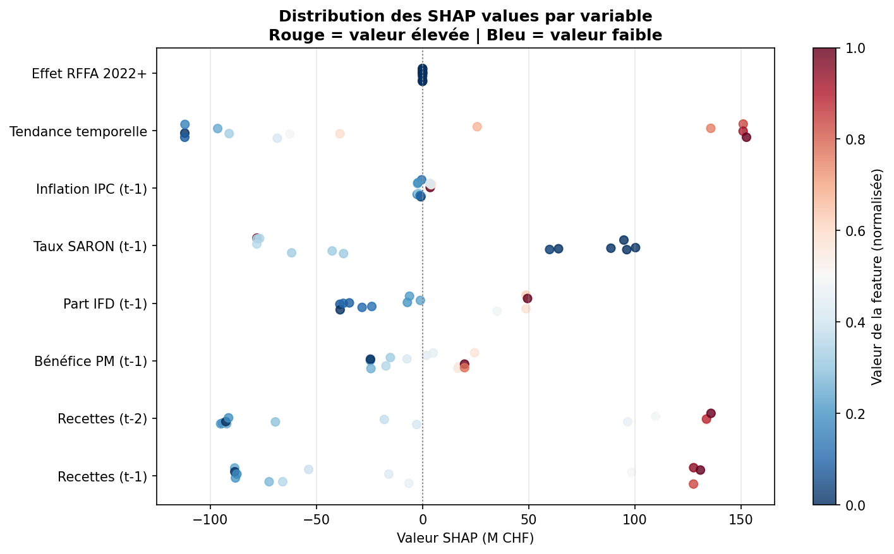
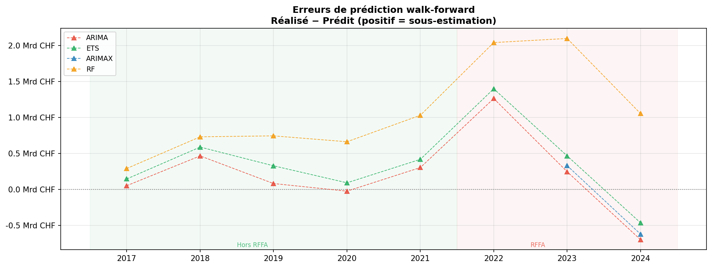
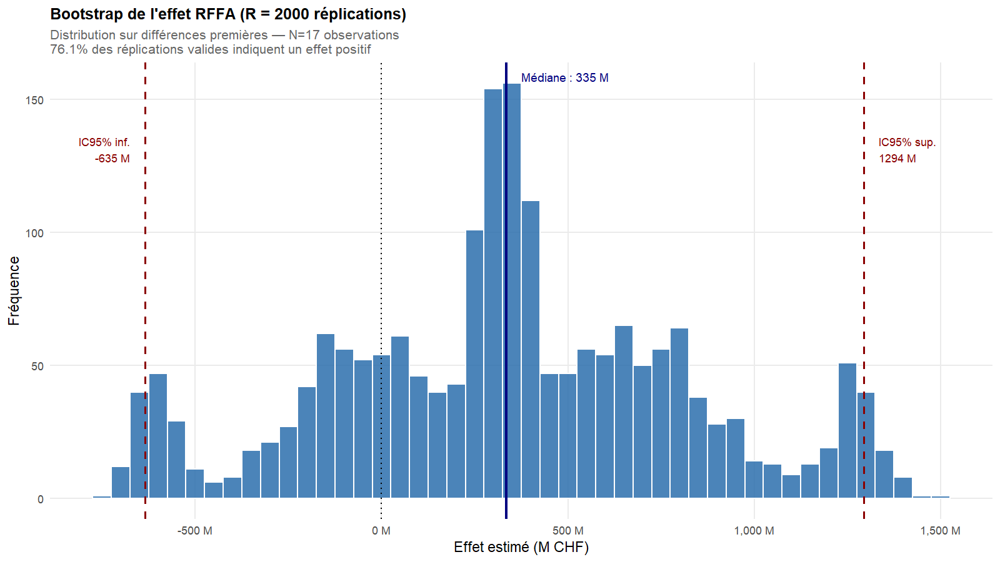
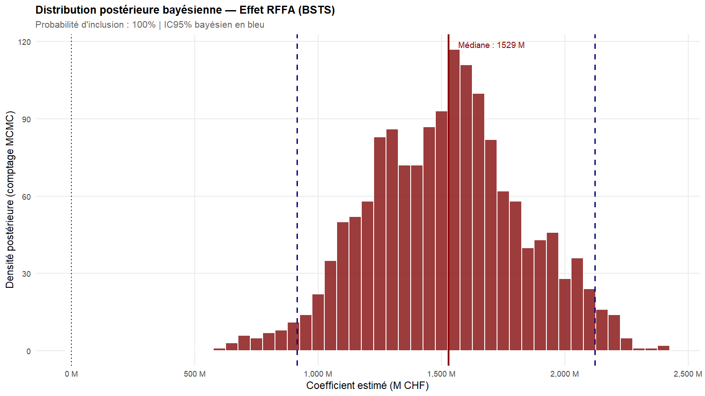

# Recettes fiscales genevoises — Analyse et prévision 2007–2024

**Auteur** : Frat DAG  
**Date** : Avril 2026  
**Données** : OCSTAT T18.02.1.15, OFS Comptes régionaux, BNS data.snb.ch  
**Langages** : R 4.x + Python 3.11

---

## La question de départ

Peut-on prévoir les recettes fiscales d'un canton suisse avec uniquement
des données publiques ? Et si oui, qu'est-ce que les données nous apprennent
vraiment — et qu'est-ce qu'elles ne permettent pas de faire ?

C'est la question centrale de ce projet. La réponse honnête est : **oui,
partiellement, avec des limites importantes qu'on documente au fur et à mesure.**
Ce README vous guide à travers chaque étape de l'analyse, en expliquant
non seulement ce qu'on a fait, mais pourquoi on l'a fait — et ce qu'on
aurait fait différemment avec de meilleures données.

---

## Encadré RFFA — À lire en premier

Avant de plonger dans les chiffres, il faut comprendre un événement
qui bouleverse toute la lecture des données après 2022.

La **Réforme fiscale et financement de l'AVS (RFFA)** est une réforme
**fédérale** entrée en vigueur le 1er janvier 2020. Elle s'applique à
tous les cantons suisses, mais ses effets sur les recettes fiscales
varient considérablement selon la structure économique de chaque canton.
Elle a supprimé les anciens régimes fiscaux préférentiels cantonaux —
des statuts spéciaux qui permettaient à certaines multinationales de
payer moins d'impôts — et les a remplacés par des instruments conformes
aux standards internationaux de l'OCDE, notamment la patent box
(réduction d'impôt sur les revenus de brevets) et les déductions R&D.

**Pourquoi Genève est particulièrement exposée ?**
Genève concentre une proportion exceptionnelle de sièges de multinationales
par rapport à sa taille — notamment dans le négoce de matières premières
(Vitol, Gunvor, Mercuria), la finance et les organisations internationales.
L'impôt sur le bénéfice des personnes morales genevois est structurellement
sensible aux profits de ces grandes entreprises — bien plus que dans
d'autres cantons.

**Pourquoi une rupture en 2022–2023 et pas en 2020 ?**
Deux effets se combinent : d'abord un délai de transition de deux ans
pendant lequel les entreprises ont adapté leurs structures fiscales.
Ensuite, des bénéfices exceptionnels post-COVID dans les secteurs
surreprésentés à Genève ont été imposés dans le nouveau régime,
produisant une hausse brutale des recettes.

**Ce qu'on peut affirmer, ce qu'on ne peut pas :**
La hausse de 2022–2023 est *partiellement* attribuable à la RFFA.
On ne peut pas la décomposer précisément sans données désagrégées
par type de contribuable — ces données ne sont pas publiques.
On traite donc la RFFA comme un choc structurel documenté,
qu'on capture via une variable indicatrice dans nos modèles.

Sources : AFC (estv.admin.ch), Canton de Genève (ge.ch),
OCDE Pilier 2 (oecd.org), OCSTAT (statistique.ge.ch)

---

## Glossaire et abréviations

Pour faciliter la lecture, voici les termes et abréviations utilisés
dans ce projet, dans l'ordre où ils apparaissent.

**Organismes et sources**
- **OCSTAT** — Office Cantonal de la STATistique du Canton de Genève
- **OFS** — Office Fédéral de la Statistique (Suisse)
- **BNS** — Banque Nationale Suisse
- **AFC** — Administration Fédérale des Contributions

**Termes fiscaux**
- **IR** — Impôt sur le Revenu des personnes physiques
- **PP** — Personnes Physiques (contribuables individuels)
- **PM** — Personnes Morales (entreprises, sociétés)
- **IFD** — Impôt Fédéral Direct — impôt prélevé par la Confédération
  dont une part est redistribuée aux cantons
- **RFFA** — Réforme Fiscale et Financement de l'AVS (voir encadré ci-dessus)
- **enreg_timbre** — "Produits de l'enregistrement et timbre" selon
  la nomenclature exacte OCSTAT — agrège les droits de mutation
  immobiliers, les droits de timbre et autres droits d'enregistrement

**Termes économiques**
- **PIB** — Produit Intérieur Brut — mesure de la richesse produite
  sur un territoire donné
- **SARON** — Swiss Average Rate Overnight — taux d'intérêt de référence
  suisse calculé quotidiennement par la BNS (voir section Données)
- **TCAM** — Taux de Croissance Annuel Moyen — croissance moyenne
  par an sur toute la période, exprimée en pourcentage
- **CV** — Coefficient de Variation — mesure de la volatilité d'une série,
  exprimée en pourcentage. Plus le CV est élevé, plus la série est
  imprévisible d'une année à l'autre

**Termes statistiques**
- **I(1)** — Série intégrée d'ordre 1 — une série dont les valeurs
  dérivent dans le temps (voir section Tests statistiques)
- **Stationnarité** — propriété d'une série dont la moyenne et la
  variance restent stables dans le temps (voir section Tests statistiques)
- **Rupture structurelle** — changement brutal et durable dans le
  comportement d'une série (ex : la RFFA en 2022)
- **Dummy variable** — variable binaire qui vaut 1 quand un événement
  s'est produit, 0 sinon. Permet de capturer l'effet d'un choc
  dans un modèle statistique
- **Cointégration** — relation de long terme stable entre plusieurs
  séries qui dérivent chacune individuellement
- **RMSE** — Root Mean Square Error — erreur quadratique moyenne,
  mesure standard de la précision d'un modèle. Plus le RMSE est
  faible, plus le modèle est précis
- **IC** — Intervalle de Confiance — fourchette dans laquelle la
  vraie valeur a X% de chances de se trouver

**Modèles statistiques**
- **ARIMA** — AutoRegressive Integrated Moving Average — modèle de
  série temporelle qui prédit une valeur future à partir des valeurs
  passées et des erreurs passées
- **ARIMAX** — ARIMA avec variables eXogènes — ARIMA enrichi avec
  des variables externes (ici la dummy RFFA)
- **ETS** — Error, Trend, Seasonality — modèle alternatif à ARIMA
  qui décompose une série en niveau, tendance et saisonnalité
- **VAR** — Vecteur AutoRégressif — modèle qui capture les interactions
  entre plusieurs séries simultanément
- **BSTS** — Bayesian Structural Time Series — modèle bayésien qui
  décompose une série en composantes latentes (niveau, tendance) estimées
  conjointement avec l'effet des variables explicatives via MCMC.
  Particulièrement adapté aux séries courtes avec ruptures structurelles

**Méthodes d'analyse**
- **SHAP** — SHapley Additive exPlanations — méthode qui mesure
  la contribution de chaque variable à chaque prédiction individuelle
- **Walk-forward** — méthode de validation qui entraîne un modèle
  sur le passé et le teste sur le futur, en avançant année par année
- **Bootstrap** — méthode de rééchantillonnage qui génère des centaines
  ou milliers d'échantillons artificiels à partir des données existantes
  pour estimer la stabilité et l'incertitude d'une estimation statistique
- **MCMC** — Markov Chain Monte Carlo — algorithme d'échantillonnage
  utilisé en statistique bayésienne pour explorer la distribution postérieure
  des paramètres. Produit une chaîne de valeurs dont la distribution
  converge vers la distribution recherchée
- **ADF** — test d'Augmented Dickey-Fuller — test de stationnarité
- **PP** — test de Phillips-Perron — test de stationnarité alternatif
- **KPSS** — test de Kwiatkowski-Phillips-Schmidt-Shin — test de
  stationnarité qui teste dans la direction opposée à ADF et PP

---

## Données — Pourquoi ces sources, pourquoi ces choix

### Ce qui était disponible et ce qu'on a retenu

| Source | Série | Période | N |
|--------|-------|---------|---|
| OCSTAT T18.02.1.15 | Recettes fiscales GE (20 postes) | 2007–2024 | 18 |
| OFS Comptes régionaux | PIB nominal Genève | 2008–2022 | 15 |
| BNS data.snb.ch | SARON (mensuel → annuel) | 2007–2024 | 18 |
| OFS via BNS | IPC total suisse (mensuel → annuel) | 2007–2024 | 18 |

La contrainte principale de ce projet est simple : **N=18 observations
annuelles**. L'OCSTAT publie les recettes fiscales cantonales en résolution
annuelle uniquement — pas de données trimestrielles ou mensuelles disponibles
publiquement. C'est une contrainte de la source, pas un choix.

Avec 18 observations, la puissance statistique de nos tests est faible.
On l'assume et on le documente partout — c'est précisément pourquoi
on triangule plusieurs tests plutôt que d'en utiliser un seul.

### Pourquoi le SARON et pas le taux directeur BNS ou le LIBOR ?

Le **taux directeur BNS** n'existe sous sa forme actuelle que depuis 2019 —
il ne couvre pas notre période d'analyse 2007–2024. Le **LIBOR** (London
Interbank Offered Rate) a été abandonné progressivement entre 2021 et 2023
et remplacé précisément par le SARON en Suisse. Le **SARON** (Swiss Average
Rate Overnight) couvre toute notre période 2007–2024, est calculé
quotidiennement par la BNS à partir de transactions réelles sur le marché
monétaire suisse, et est la référence officielle depuis la fin du LIBOR.
C'est donc le seul choix cohérent sur l'ensemble de la période.

### Pourquoi le PIB genevois s'arrête en 2022 ?

Les comptes régionaux OFS sont publiés avec un délai de 2 à 3 ans.
En avril 2026, les données disponibles s'arrêtent en 2022 (provisoire).
C'est pourquoi le PIB n'est pas utilisé comme régresseur dans les modèles
de prévision — on ne peut pas prévoir 2025–2027 avec une variable
dont on ne connaît pas les valeurs récentes.

### Note sur la nomenclature IR

À partir de 2012, l'OCSTAT a séparé les impôts à la source de l'impôt
sur le revenu dans sa nomenclature. Avant 2012, les deux étaient regroupés.
Résultat : l'IR semble baisser nominalement sur 2007–2024, alors qu'il
s'agit d'un artefact comptable. On utilise `pp_total` (total des impôts
des personnes physiques) comme proxy cohérent sur toute la période.

---

## Résumé de l'approche — Avant de rentrer dans le vif du sujet

Ce projet suit une **approche inductive** : les données posent les questions,
les questions déterminent les tests, les tests déterminent les modèles.
On ne choisit pas les méthodes avant d'avoir regardé les données.

**Ce qu'on cherche à savoir :**
Les recettes fiscales genevoises sont-elles prévisibles ? Quels sont
les facteurs qui les font bouger d'une année à l'autre ? La RFFA
a-t-elle vraiment changé la structure des recettes ?

**Ce qu'on sait d'avance qui va poser problème :**
N=18 est un échantillon très petit pour des méthodes économétriques
sérieuses. Les tests statistiques manquent de puissance. Les modèles
risquent d'être instables. La rupture de 2022 est si récente qu'elle
est difficile à traiter formellement. On le sait, on l'assume, et on
choisit de le faire quand même — parce que documenter honnêtement
les limites d'une analyse sur données publiques réelles est plus utile
que de ne rien faire.

**La démarche en six étapes :**
1. On regarde les données sans hypothèse — qu'est-ce qu'elles nous disent ?
2. On teste formellement ce qu'on a observé visuellement
3. On construit des modèles du plus simple au plus complexe
4. On analyse quelles variables expliquent les variations
5. On valide les modèles sur des données qu'ils n'ont pas vues
6. On triangule les résultats clés depuis un paradigme bayésien indépendant

---

## Structure du projet

```
recettes-fiscales-genevoises/
├── README.md
├── R/
│   ├── scripts/
│   │   ├── 01_exploration.R
│   │   ├── 02_tests.R
│   │   ├── 03_modeles.R
│   │   ├── 04_shap.R
│   │   ├── 04b_walkforward.R
│   │   └── 05_robustesse_BSTS.R      ← analyse de robustesse bayésienne
│   └── figures/
│       ├── 01_total_evolution.png
│       ├── 01_decomposition.png
│       ├── 02_stationnarite_visuelle.png
│       ├── 03_comparaison_modeles.png
│       ├── 03_residus_modele_retenu.png
│       ├── 04_shap_importance.png
│       ├── 04_shap_beeswarm.png
│       ├── 04_shap_vs_rf_importance.png
│       ├── 04b_walkforward.png
│       ├── 04b_erreurs_walkforward.png
│       ├── 05_bootstrap_rffa.png
│       └── 05_bsts_posterieur.png
└── Python/
    ├── notebooks/
    │   ├── 01_exploration.ipynb
    │   ├── 02_tests.ipynb
    │   ├── 03_modeles.ipynb
    │   ├── 04_shap.ipynb
    │   └── 04b_walkforward.ipynb
    └── figures/                       ← suffixe _py pour distinguer de R
        ├── 01_correlation_heatmap_py.png
        ├── 03_comparaison_modeles_py.png
        ├── 04_shap_importance_py.png
        ├── 04_shap_beeswarm_py.png
        └── 04b_erreurs_walkforward_py.png
```

---

## 1. Exploration (script 01)

### Ce qu'on cherche à cette étape

Avant tout test, avant tout modèle : regarder les données telles qu'elles sont.
On cherche des tendances, des anomalies, des ruptures visuelles, et des questions
que les données posent naturellement. Ces questions structureront toute
la suite de l'analyse.

### Ce que les données nous montrent



Les recettes fiscales genevoises ont augmenté de 5'971M CHF en 2007
à 9'269M CHF en 2024, soit un taux de croissance annuel moyen (TCAM)
de +2.62%/an. Mais cette moyenne cache des trajectoires très différentes
selon les composantes.



**Ce que le graphique révèle immédiatement :**

La croissance n'est pas portée par tout le monde de la même façon.
L'impôt sur le revenu des personnes physiques (IR) — la composante
la plus volumineuse — recule nominalement sur la période (-0.49%/an).
C'est un artefact de nomenclature OCSTAT 2012 (voir section Données),
pas un phénomène économique réel. En revanche, l'impôt sur le bénéfice
des personnes morales (ben_pm) croît à +3.97%/an et la part cantonale
de l'IFD à +5.18%/an. Ce sont eux qui tirent le total vers le haut.

**Ce que ça signifie en pratique :**
La croissance des recettes fiscales genevoises repose structurellement
sur les entreprises, pas sur les ménages. Genève est fiscalement
dépendante des bénéfices de ses grandes entreprises — ce qui explique
à la fois sa prospérité en période de bons résultats corporatifs
et sa vulnérabilité aux cycles économiques des multinationales.

**Les années atypiques :**
- **2010 : -6.4%** — contrecoup de la crise financière de 2008
- **2018 : +8.0%** — bond qui dépasse la tendance normale, premier signal
  d'une recomposition fiscale
- **2020 : +1.2%** — le COVID n'a pas produit de rupture fiscale à Genève,
  ce qui témoigne de la résilience du tissu économique genevois
- **2022 : +17.8%** — rupture majeure liée à la RFFA (voir encadré)

**Volatilité relative des composantes (CV) :**

| Composante | CV | Interprétation |
|-----------|-----|----------------|
| IR | 9.7% | Très stable — suit l'emploi |
| PP total | 12.8% | Stable |
| Ben_pm | 31.7% | Volatile — suit les cycles de bénéfices |
| Fortune | 30.0% | Volatile |
| Enreg. et timbre | 25.4% | Modérément volatile |
| Successions | 37.8% | Très volatile — outlier 2009 |
| IFD | 40.8% | Très volatile — amplifiée par la RFFA |

**Sept questions émergent de cette exploration :**
Ces questions structurent entièrement le script 02 — on ne teste
que ce que les données nous ont demandé de tester.

---

## 2. Tests statistiques (script 02)

### Pourquoi tester avant de modéliser ?

Construire un modèle sur des données qu'on ne comprend pas, c'est
construire une maison sans sonder le terrain. Les tests statistiques
de cette section répondent à des questions fondamentales : les séries
dérivent-elles dans le temps ? Y a-t-il eu des ruptures réelles ?
Les variables sont-elles vraiment liées ou est-ce une illusion ?

Les réponses déterminent directement quels modèles on peut utiliser
dans la section suivante. On ne choisit pas les modèles avant d'avoir
ces réponses.

### Q7 — Pourquoi l'IR décroît-il en tendance ? (traité en premier)

Cette question est traitée avant les tests de stationnarité parce qu'elle
conditionne tout le reste. Si l'IR baisse pour une raison comptable et non
économique, inclure l'IR brut dans nos tests et modèles introduit un biais
de mesure — comme mesurer une croissance en changeant d'unité à mi-parcours.

**Ce qu'on découvre :**
En 2012, l'OCSTAT a séparé les impôts à la source de l'IR.
L'IR 2007–2011 incluait les impôts à la source. L'IR 2012–2024 ne les
inclut plus.

| Période | IR moyen |
|---------|---------|
| 2007–2011 (avec impôts à la source) | 3'186M |
| 2012–2024 (sans impôts à la source) | 2'731M |
| 2012–2024 (corrigé, avec impôts à la source) | 3'617M |

La baisse de l'IR est un artefact comptable. On utilise `pp_total`
(total des impôts des personnes physiques) comme proxy cohérent
sur toute la période 2007–2024.

### Q1 — Les séries sont-elles stationnaires ?

**Pourquoi c'est important :**
Une série **stationnaire** oscille autour d'une moyenne stable — comme
un pendule qui revient toujours à sa position d'équilibre. Une série
**non stationnaire** (ou I(1)) dérive dans le temps sans ancrage fixe —
comme un bateau sans ancre sur une mer agitée.

Si on modélise une série non stationnaire sans le savoir, on obtient
des résultats qui semblent solides mais qui sont en réalité du bruit.
Deux séries qui dérivent toutes les deux à la hausse vont sembler
fortement corrélées même si elles n'ont aucun lien réel — c'est
la **corrélation spurieuse**, l'un des pièges classiques de l'économétrie.

**Pourquoi trois tests et pas un seul ?**
Avec N=18 observations, aucun test pris seul n'est fiable — leur puissance
statistique est trop faible. En utilisant trois tests qui fonctionnent
différemment, on peut trianguler les conclusions :

- **ADF (Augmented Dickey-Fuller)** : teste si la série a une racine
  unitaire (signe de non-stationnarité) en contrôlant pour l'autocorrélation
- **PP (Phillips-Perron)** : même objectif que l'ADF mais avec une
  correction différente — plus robuste à certaines formes d'irrégularités
- **KPSS** : teste dans la direction opposée — H0 est "la série est
  stationnaire". Si ADF dit "non stationnaire" ET KPSS dit "non stationnaire",
  la conclusion est beaucoup plus solide qu'avec un seul test

On a aussi utilisé le test de **Zivot-Andrews**, qui identifie endogènement
(sans présupposer la date) le point de rupture le plus probable dans la série.
Contrairement au test de Chow qui teste une date fixée a priori,
Zivot-Andrews dit "si une rupture existe, elle est probablement quand ?"



*Le graphique montre chaque série en niveau (à gauche) et après
différenciation (à droite). Une série différenciée stationnaire oscille
autour de zéro sans tendance — c'est ce qu'on cherche à confirmer.*

**Résultats de la triangulation ADF + PP + KPSS :**

| Série | Conclusion |
|-------|-----------|
| Total recettes | I(1) — confirmé par les trois tests |
| PP total | I(1) — confirmé par les trois tests |
| Fortune PP | I(1) — confirmé par les trois tests |
| IFD | I(1) — KPSS confirme malgré ADF ambigu |
| Bénéfice PM | Ambigu — traité comme I(1) car la rupture RFFA perturbe les tests |
| Enreg. et timbre | Ambigu — utilisé comme régresseur potentiel uniquement |

**Zivot-Andrews détecte :**
- Total recettes : rupture endogène en 2018
- Bénéfice PM : rupture endogène en 2019
- IFD : pas de rupture structurelle claire

*Ces dates sont cohérentes avec le bond de +8% observé en 2018 —
premier signal d'une recomposition fiscale avant la rupture majeure de 2022.*

**Ce que ça implique pour la suite :**
Les séries sont I(1) — elles dérivent dans le temps. On devra travailler
sur les variations annuelles plutôt que sur les niveaux bruts.
C'est cette conclusion qui détermine directement le type de modèles
qu'on peut utiliser dans le script 03.

### Q2 — Y a-t-il eu des ruptures structurelles confirmées ?

**Pourquoi c'est important :**
Une rupture structurelle est un changement brutal et durable dans le
comportement d'une série. Si on ne la détecte pas et qu'on ne la traite
pas, le modèle va essayer d'expliquer la rupture avec la tendance normale,
ce qui biaise toutes les prévisions.

**Méthode — Test de Chow :**
Le test de Chow vérifie si les paramètres d'une régression changent
significativement avant et après un point de rupture choisi a priori.

| Année testée | F-stat | p-value | Conclusion |
|-------------|--------|---------|-----------|
| 2010 | 4.197 | 0.037 | **Rupture confirmée** — contrecoup crise 2008 |
| 2020 | 18.59 | ≈0 | **Rupture confirmée** — résilience genevoise |
| 2022 | — | — | Non testable — seulement 3 observations après 2022 |

*2020 montre une rupture très significative mais dans le sens d'une
résilience — les recettes n'ont pas chuté comme on aurait pu l'attendre.
La rupture de 2022 ne peut pas être testée formellement — on la traite
via une dummy variable en Q6.*

### Q3 — Comment traiter l'outlier des successions en 2009 ?

Les droits de succession 2009 atteignent 308M CHF contre une médiane
de 188M sur toute la série — un écart de 1.7 sigma. Ce pic est
probablement lié à des successions exceptionnelles réglées dans le
contexte post-crise financière de 2008–2009.

**Décision :** La série des successions est exclue de la modélisation
principale en raison de sa volatilité (CV=37.8%) et de cet outlier.
Une variable indicatrice est créée en réserve pour usage éventuel.

### Q4 — Les séries sont-elles liées sur le long terme ?

**Pourquoi c'est important :**
Si plusieurs séries I(1) partagent une relation de long terme stable
malgré leurs dérives individuelles — c'est la **cointégration** —
le modèle adapté est un VECM. Sinon, on utilise un VAR en différences,
plus simple et plus conservateur.

**Résultats — Test de Johansen :**
- Test trace : suggère une cointégration
- Test valeur propre max : ne rejette pas l'absence de cointégration à 5%

Les deux tests divergent — ce qui arrive fréquemment sur petit échantillon.
Par principe de prudence : **pas de cointégration confirmée → VAR en différences.**

### Q5 — Les corrélations observées sont-elles réelles ou illusoires ?

**Le piège de la corrélation spurieuse :**
Deux séries qui montent toutes les deux au fil du temps vont sembler
fortement corrélées même sans lien causal. Pour détecter ce piège,
on recalcule les corrélations sur les **variations annuelles** plutôt
que sur les niveaux bruts.

**Résultat le plus frappant :**

| Variable | Corrélation avec total (niveaux) | Corrélation avec total (différences) | Verdict |
|----------|----------------------------------|--------------------------------------|---------|
| Fortune PP | 0.86 | **0.05** | Spurieuse — exclue |
| Bénéfice PM | 0.89 | 0.71 | Réelle |
| PIB genevois | 0.96 | 0.61 | Réelle et structurelle |
| IFD | 0.93 | 0.50 | Réelle |
| SARON | -0.36 | 0.44 | Réelle (via cycle emploi) |

*La fortune PP est le cas le plus spectaculaire : une corrélation de 0.86
en niveaux qui s'effondre à 0.05 en différences. Si on avait inclus
la fortune comme régresseur sans ce test, on aurait construit un modèle
sur du sable.*

### Q6 — Comment quantifier l'effet de la RFFA ?

**Les dummies — à quoi ça sert :**
Une dummy variable est une variable binaire qui vaut 1 quand un événement
s'est produit et 0 sinon. Son coefficient mesure l'effet moyen de cet
événement sur la variable modélisée, toutes choses égales par ailleurs.

**Trois dummies créées et testées :**

| Dummy | Définition | Coefficient | p-value | Décision |
|-------|-----------|-------------|---------|---------|
| dummy_rffa | =1 si annee ≥ 2022 | +1729M | ≈0 | **Intégrée dans tous les modèles** |
| dummy_covid | =1 si annee = 2020 | +153M | 0.61 | Exclue — non significative |
| dummy_succ_2009 | =1 si annee = 2009 | — | — | En réserve |

*La dummy_covid non significative (p=0.61) est en soi un résultat important :
Genève n'a pas subi de rupture fiscale en 2020. La diversité de son tissu
économique a amorti le choc — multinationales, organisations internationales,
secteur financier ont maintenu leurs activités.*

*L'ajout de la dummy_rffa dans un modèle de régression simple fait passer
le R² de 0.787 à 0.960 — la RFFA explique à elle seule une grande partie
de la variance résiduelle.*

---

## 3. Modèles (script 03)

### Le but de cette étape

On a maintenant une compréhension solide des données. L'objectif n'est
pas de trouver le modèle parfait (il n'existe pas avec N=18), mais de
trouver le modèle le plus honnête : celui qui performe le mieux tout
en étant justifié par ce qu'on a appris dans les étapes précédentes.

**Stratégie :** on construit les modèles du plus simple au plus complexe.
Chaque modèle doit battre le précédent pour justifier sa complexité
supplémentaire. Si un modèle complexe ne fait pas mieux qu'un modèle
simple, on garde le simple — c'est le principe de parcimonie.

### Étape 1 — ARIMA baseline : le point de départ

**Ce qu'est un modèle ARIMA :**
ARIMA prédit une valeur future à partir de trois éléments : les valeurs
passées de la série, les erreurs de prédiction passées, et la
différenciation de la série (qui traite la non-stationnarité identifiée en Q1).

Le modèle retenu est **ARIMA(0,1,0) avec drift** — en termes simples :
la meilleure prévision pour l'année prochaine est la valeur de cette année
plus une croissance annuelle moyenne constante de 194M CHF.

**Performance :** RMSE = 391M CHF | Ljung-Box p = 0.613 ✓

### Étape 2 — ETS : une alternative à ARIMA

**Ce qu'est un modèle ETS :**
ETS modélise directement le niveau et la tendance de la série.
Le modèle retenu **ETS(M,N,N)** avec alpha = 0.9999 colle presque
exclusivement à la dernière observation — sa prévision est simplement
la dernière valeur connue, sans tendance.

**Performance :** RMSE = 434M CHF — inférieur à ARIMA. ARIMA reste la référence.

### Étape 3 — ARIMAX : intégrer ce qu'on sait de la RFFA

**Ce qu'est un modèle ARIMAX :**
ARIMAX est un ARIMA enrichi avec des variables externes. Ici, on ajoute
la dummy_rffa identifiée en Q6. Si on sait qu'un événement structurel
s'est produit, autant l'inclure explicitement dans le modèle.

**Performance :** RMSE = 283M CHF | Ljung-Box p = 0.748 ✓

L'ajout de la dummy_rffa réduit l'erreur de **27.7%** par rapport à ARIMA.
Le coefficient est +1398M (p≈0) — à partir de 2022, les recettes sont
en moyenne 1398M CHF plus élevées que ce que la tendance prédirait.

**ARIMAX est retenu comme modèle de référence.**

### Étape 4 — VAR : capturer les interactions entre séries

Un VAR modélise plusieurs séries simultanément en capturant leurs interactions.
Avec N=14 observations effectives et 3 variables, le modèle est inévitablement
surparamétré — aucun coefficient n'est significatif. Il est présenté comme
modèle exploratoire, pas comme alternative à l'ARIMAX.

### Comparaison des quatre modèles


| Modèle | RMSE training | Ljung-Box p | Statut |
|--------|--------------|-------------|--------|
| ARIMA(0,1,0) + drift | 391M | 0.613 | Baseline |
| ETS(M,N,N) | 434M | 0.683 | Inférieur à ARIMA |
| **ARIMAX(0,1,0) + dummy_rffa** | **283M** | **0.748** | **Retenu** |
| VAR(1) en différences | — | — | Exploratoire |

*Le test de Ljung-Box vérifie que les résidus du modèle sont du bruit blanc —
c'est-à-dire qu'il ne reste plus d'information exploitable dans les erreurs.
Un p > 0.05 confirme que le modèle a bien capturé la structure des données.*


*Les résidus oscillent aléatoirement autour de zéro — le modèle est bien spécifié.*

### Prévisions 2025–2027

| Année | Point forecast | IC 80% | IC 95% |
|-------|---------------|--------|--------|
| 2025 | 9'269M | [8'885 – 9'653] | [8'681 – 9'857] |
| 2026 | 9'269M | [8'726 – 9'812] | [8'438 – 10'100] |
| 2027 | 9'269M | [8'604 – 9'934] | [8'251 – 10'287] |

**Pourquoi un plateau à 9'269M ?**
Le modèle prédit que la meilleure estimation pour chaque année future
est le dernier niveau observé (2024 = 9'269M). Ce plateau reflète
une hypothèse de stabilisation post-RFFA — pas une trajectoire de
croissance. Les intervalles de confiance s'élargissent d'année en année :
plus on prédit loin, moins on est précis.

*Note : ETS et ARIMAX donnent le même point forecast (9'269M) pour des
raisons différentes — ETS par inertie pure, ARIMAX par structure du modèle
avec dummy constante. Ce n'est pas une coïncidence troublante, c'est
une convergence de deux logiques vers le même résultat.*

---

## 4. Analyse SHAP des drivers (script 04)

### Le but de cette étape

Les modèles économétriques nous disent **ce que** les recettes vont faire.
Ils ne nous disent pas **pourquoi** elles bougent d'une année à l'autre.
Cette section répond à cette question.

**Pourquoi un Random Forest ?**
Le Random Forest est un modèle non linéaire qui capture des interactions
complexes entre variables. Couplé aux SHAP values, il mesure la contribution
de chaque variable à chaque prédiction individuelle.

**Important : le Random Forest est utilisé ici uniquement pour analyser
les drivers — pas pour prévoir.** Ses performances prédictives sont
inférieures à l'ARIMAX, et c'est attendu.

### Qu'est-ce que t-1 et t-2 signifient ?

Dans cette analyse, toutes les variables sont des **lags** — des valeurs
décalées dans le temps. `total_lag1` désigne les recettes fiscales de
l'année précédente (t-1), `ben_pm_lag1` désigne les bénéfices PM de
l'année précédente, etc.

On utilise uniquement des variables passées pour prédire l'année courante —
c'est ce qu'on appelle éviter le **data leakage** : on ne triche pas en
utilisant des informations qu'on n'aurait pas eues en conditions réelles.

### Qu'est-ce que les SHAP values mesurent ?

Les **SHAP values** mesurent la contribution de chaque variable à chaque
prédiction individuelle, exprimée en millions de CHF. Une SHAP value
positive signifie que la variable **pousse les recettes vers le haut**.
Une valeur négative signifie qu'elle les **pousse vers le bas**.




*Dans le graphique beeswarm, chaque point représente une année d'observation.
Les points rouges indiquent que la variable a poussé les recettes vers
le haut cette année-là. Les points bleus indiquent l'inverse.
(Graphique généré via Python/shap — rendu Seaborn.)*

### Classement SHAP — ce que ça nous dit

| Rang | Variable | SHAP moyen | Interprétation |
|------|----------|-----------|----------------|
| 1 | Recettes fiscales (t-1) | 120M | La mémoire fiscale domine |
| 2 | Tendance temporelle | 112M | Force de fond haussière |
| 3 | Recettes fiscales (t-2) | 85M | La mémoire à deux ans compte aussi |
| 4 | Part IFD (t-1) | 63M | Signal indirect de l'activité des grandes entreprises |
| 5 | Taux SARON (t-1) | 50M | Signal du cycle économique via l'emploi |
| 6 | Bénéfice PM (t-1) | 28M | Effet direct mais moins prévisible |
| 7 | Inflation IPC (t-1) | 5M | Effet marginal |
| 8 | Effet RFFA 2022+ | 0M* | Voir note ci-dessous |

*La dummy_rffa vaut 0 pour toutes les années du training (2009–2021).
Le Random Forest n'a jamais observé dummy_rffa = 1 pendant l'entraînement —
il ne peut donc pas apprendre son effet. Ce résultat est cohérent et attendu.
L'effet RFFA est capturé par l'ARIMAX (+1398M, p≈0), pas par le RF.*

*L'IFD devance le bénéfice PM en importance SHAP (63M vs 28M) parce que
l'IFD capture indirectement l'effet RFFA via la redistribution fédérale
des impôts sur les bénéfices des grandes entreprises genevoises — il est
un signal plus stable que le bénéfice PM, très volatile d'une année à l'autre.*


*Les deux méthodes d'importance donnent le même classement — c'est un signal
de robustesse : la conclusion ne dépend pas de la méthode choisie.*

---

## 5. Validation walk-forward (script 04b)

### Pourquoi ce script séparé — soyons honnêtes

Ce script n'était pas prévu dans le plan initial. En fin de projet,
on a réalisé que les modèles avaient été évalués uniquement sur leurs
données d'entraînement — ce qui n'est pas une validation équitable.
Un modèle qui prédit bien ce qu'il a déjà vu n'est pas nécessairement
bon pour prédire ce qu'il n'a pas vu. Cette lacune a été corrigée avec
ce script dédié.

### Qu'est-ce que la validation walk-forward ?

La validation walk-forward simule exactement les conditions réelles
d'utilisation d'un modèle :

1. On entraîne le modèle sur 2007–2016
2. On prédit 2017 et on note l'erreur
3. On ajoute 2017 aux données d'entraînement
4. On prédit 2018 et on note l'erreur
5. Et ainsi de suite jusqu'à 2024

Cette approche respecte toujours l'ordre temporel — on n'entraîne jamais
sur des données futures. Elle donne une image honnête des performances
réelles de chaque modèle et permet une comparaison équitable entre eux.

### Prédictions vs réalisations — année par année


| Année | Réalisé | ARIMA | ETS | ARIMAX | RF |
|-------|---------|-------|-----|--------|----|
| 2017 | 6'641M | 6'590M | 6'496M | n/a† | 6'434M |
| 2018 | 7'173M | 6'708M | 6'585M | n/a† | 6'499M |
| 2019 | 7'363M | 7'282M | 7'022M | n/a† | 6'909M |
| 2020 | 7'454M | 7'479M | 7'350M | n/a† | 6'999M |
| 2021 | 7'871M | 7'568M | 7'454M | n/a† | 7'078M |
| 2022 | 9'269M | 8'007M | 7'871M | n/a† | 7'530M |
| 2023 | 9'734M | 9'489M | 9'269M | 9'269M | 8'555M |
| 2024 | 9'269M | 9'969M | 9'734M | 9'734M | 9'150M |

†ARIMAX non estimable avant 2023 : dummy_rffa = 0 sur tout l'entraînement
ET le test pour 2017–2022 — le modèle est identique à ARIMA pur.

*Ce tableau montre que toutes les erreurs importantes se concentrent
sur 2022–2024 — la rupture RFFA était imprévisible pour tous les modèles
qui ne l'avaient pas vue en entraînement. C'est une limite documentée,
pas une surprise.*



*Le graphique des erreurs confirme que toutes les erreurs importantes
se concentrent sur 2022–2024. Sur 2017–2021, les erreurs sont modestes
et sans biais systématique — signe que les modèles fonctionnent correctement
en conditions normales. (Graphique généré via Python — version plus lisible
que l'équivalent R.)*

### RMSE walk-forward — comparaison équitable

**Toutes années 2017–2024 :**

| Modèle | RMSE | Note |
|--------|------|------|
| ARIMAX | 465M | Non estimable avant 2023† |
| ARIMA baseline | 555M | |
| ETS | 618M | |
| Random Forest | 864M | |

**Hors RFFA 2017–2021 — la mesure la plus honnête :**

*Cette fenêtre exclut les années dominées par la rupture RFFA.
Elle mesure les capacités prédictives réelles des modèles en conditions
normales, sans choc exogène imprévisible.*

| Modèle | RMSE |
|--------|------|
| **ARIMA baseline** | **252M** |
| ETS | 365M |
| Random Forest | 555M |
| ARIMAX | exclu† |

*ARIMA est le meilleur modèle en conditions normales (252M hors RFFA).
ARIMAX est le meilleur sur l'ensemble de la période (465M), mais seulement
parce qu'il bénéficie d'avoir vu 2022 en entraînement pour prédire 2023–2024.
Ces deux résultats sont complémentaires — ARIMAX est retenu pour les
prévisions 2025–2027 parce que la rupture RFFA est documentée et persistante.*

---

## 5. Robustesse bayésienne (script 05)

### Pourquoi aller plus loin après le walk-forward ?

Le walk-forward valide les modèles dans le temps. Il répond à la question :
"Ces modèles auraient-ils été utiles si on les avait utilisés en conditions réelles ?"

Le script 05 répond à une question différente : "L'effet RFFA de +1398M estimé
via ARIMAX est-il robuste à un changement complet de paradigme statistique ?"
On triangule depuis deux angles indépendants — bootstrap et modèle bayésien —
pour s'assurer que le résultat clé du projet n'est pas un artefact de la méthode.

### Bootstrap — Stabilité de l'estimation OLS

**Pourquoi bootstrapper ?**
L'ARIMAX estime l'effet RFFA via maximum de vraisemblance sur N=18 observations.
Le bootstrap génère 2000 échantillons par rééchantillonnage et réestime l'effet
sur chacun d'eux — ce qui révèle à quel point l'estimation dépend de chaque
observation individuelle.

On travaille sur les **différences premières** (série stationnaire I(1), confirmé
en script 02) pour respecter les propriétés de la série.

**Résultats :**



L'intervalle de confiance à 95% est large [-635M ; +1294M] — ce qui est attendu
avec N=17 différences dont seulement 2–3 observations post-RFFA disponibles.
Ce n'est pas une contradiction de l'ARIMAX, c'est la même incertitude
exprimée différemment. Ce qui importe : **76.1% des réplications valides
indiquent un effet positif**, avec une médiane à +335M CHF. La distribution
est clairement asymétrique vers la droite — zéro se trouve dans la queue gauche,
pas au centre. La direction de l'effet est stable ; c'est sa magnitude exacte
qui reste incertaine, ce qui est documenté de manière transparente dans les conclusions.

*Note : 79 réplications sur 2000 (4%) ont été exclues car le rééchantillonnage
aléatoire ne contenait aucune observation post-RFFA — lm() ne peut pas estimer
un coefficient sur une variable constante. C'est une conséquence attendue
de la rareté des observations post-RFFA (2–3 sur 17), pas un défaut du bootstrap.*

### BSTS — Modèle Bayésien Structurel de Séries Temporelles

**Qu'est-ce que le BSTS apporte ?**
Le BSTS (Bayesian Structural Time Series) traite la tendance des recettes
comme un **état latent** qui évolue année après année — sans supposer une
forme fonctionnelle fixe a priori. L'effet de la dummy RFFA est estimé
conjointement avec la tendance via MCMC.

C'est particulièrement adapté à notre situation : avec N=18, la tendance
sous-jacente est difficile à séparer du choc RFFA via OLS. Le BSTS le fait
de manière probabiliste, en propageant l'incertitude sur la tendance jusque
dans l'estimation du coefficient.

**Résultat clé :**



La probabilité d'inclusion bayésienne de la dummy RFFA est de **100%** — dans
100% des itérations MCMC, le modèle juge la variable indispensable pour expliquer
la série. La médiane postérieure est de **+1529M CHF**, très proche de l'estimation
ARIMAX (+1398M), avec un IC95% bayésien entièrement positif [+914M ; +2121M] —
zéro est exclu avec une certitude bayésienne totale. Sur N=18 avec une seule
rupture récente, c'est le résultat le plus fort du script 05.

### Synthèse — Convergence des trois approches

| Méthode | Paradigme | Estimation effet RFFA |
|---------|-----------|----------------------|
| ARIMAX (script 03) | Fréquentiste — maximum de vraisemblance | +1398M (p≈0) |
| Bootstrap OLS (script 05) | Rééchantillonnage | +335M (médiane) — 76.1% réplications positives |
| BSTS (script 05) | Bayésien — MCMC | +1529M (médiane) — IC95% [+914M ; +2121M] |

*Les trois méthodes convergent sur la direction de l'effet. Les différences
de magnitude sont attendues : elles opèrent sur des transformations différentes
de la série (niveaux vs différences premières) et font des hypothèses différentes
sur la tendance sous-jacente. Le BSTS, qui estime l'effet directement sur les
niveaux en modélisant la tendance comme état latent, converge vers +1529M —
quasi identique à l'ARIMAX (+1398M). La convergence directionnelle et
l'accord des deux estimations en niveaux constituent le signal de robustesse
le plus important.*

---

## Ce que ce projet nous apprend

Six conclusions émergent de l'ensemble de cette analyse.

**1. La croissance fiscale genevoise repose sur les entreprises, pas sur les ménages.**
L'impôt sur le bénéfice des personnes morales croît à +3.97%/an et l'IFD
à +5.18%/an sur 2007–2024. L'IR des personnes physiques recule nominalement.
Genève est structurellement dépendante des cycles de bénéfices de ses
grandes entreprises.

**2. La RFFA représente un choc de +1398M CHF sur les recettes annuelles.**
Estimé via ARIMAX (p≈0) et confirmé par deux méthodes indépendantes : le BSTS
bayésien converge à +1529M (IC95% [+914M ; +2121M], prob. inclusion 100%)
et le bootstrap indique 76.1% de réplications positives. Ce chiffre est une
estimation globale — il ne peut pas être décomposé entre effet RFFA pur, cycle
économique post-COVID et effets sectoriels sans données désagrégées non disponibles
publiquement.

**3. La fortune PP est un piège statistique.**
Corrélation de 0.86 avec le total des recettes en niveaux → 0.05 en
différences premières. La relation est entièrement spurieuse — due aux
tendances haussières communes. L'inclure comme régresseur sans ce test
aurait produit un modèle trompeur.

**4. Genève a traversé le COVID sans rupture fiscale.**
La dummy_covid est non significative (p=0.61). La résilience du tissu
économique genevois — multinationales, organisations internationales,
finance — a amorti un choc qui a affecté sévèrement d'autres économies.

**5. La mémoire fiscale domine les variations annuelles.**
Les recettes de l'année précédente (SHAP = 120M) et de l'avant-dernière
année (85M) sont les premiers drivers identifiés. Les recettes genevoises
suivent principalement leur propre inertie — ce qui rend l'ARIMA(0,1,0)
particulièrement adapté comme baseline.

**6. Le SARON est un signal du cycle économique, pas une cause directe.**
La corrélation SARON/recettes passe par le cycle de l'emploi : une économie
en croissance crée de l'emploi, élargit la masse salariale imposable et
accroît les bénéfices des entreprises — ce qui se traduit en recettes
fiscales. Le SARON monte quand la BNS juge que l'économie est en surchauffe,
pas l'inverse.

---

## Limitations

Ce projet documente ses limites de manière explicite —
l'honnêteté méthodologique est une exigence, pas une option.

**Taille de l'échantillon (N=18)**
C'est la limite principale. Avec 18 observations annuelles, la puissance
des tests statistiques est faible. Un test qui "ne rejette pas" ne prouve
pas l'absence d'un phénomène — il manque simplement de puissance pour
le détecter. C'est pourquoi on triangule systématiquement plusieurs tests.
Le bootstrap (script 05) illustre concrètement cette contrainte : l'IC95%
est large non pas parce que l'effet est absent, mais parce qu'avec N=17
différences dont 2–3 post-RFFA, l'estimation ne peut pas être précise.

**Données annuelles uniquement**
Contrainte imposée par la source OCSTAT. Des données trimestrielles
multiplieraient N par 4 et rendraient tous les tests beaucoup plus robustes.

**Effet RFFA non décomposé**
La dummy_rffa capture un effet global de +1398M. La décomposition entre
RFFA pure, cycle post-COVID et effets sectoriels nécessiterait des données
désagrégées par type de contribuable — non disponibles publiquement.

**SHAP values instables**
N=13 observations en training pour le Random Forest. Les SHAP values
sont des indicateurs de direction, pas des mesures précises.

**Hypothèse de persistance RFFA**
Les prévisions 2025–2027 supposent que l'effet RFFA persiste (dummy=1).
Si les bénéfices des grandes entreprises se normalisent — comme le suggère
la baisse de 2024 — les recettes pourraient revenir vers la tendance
pré-RFFA plus rapidement que prévu.

**PIB disponible jusqu'en 2022 seulement**
Les comptes régionaux OFS sont publiés avec un délai de 2–3 ans.
Le PIB genevois n'est pas utilisé comme régresseur dans les modèles
de prévision pour cette raison.

---

## Améliorations possibles

### Avec de nouvelles données
- **Données trimestrielles** (internes AFC/SCC) : multiplier N par 4
- **Modèle de panel multi-cantonal** (GE, ZH, VD, BS) : isoler les effets genevois
- **Taux de change EUR/CHF, USD/CHF** : capturer l'exposition internationale
- **Masse salariale cantonale** (OFS) : améliorer la modélisation de l'IR
- **Données désagrégées par contribuable** (AFC) : décomposer l'effet RFFA

### Avec les données actuelles
- **Graphiques interactifs plotly** pour GitHub Pages
- **Intervalles de prévision par bootstrap** : étendre le script 05 pour produire
  des IC de prévision 2025–2027 par rééchantillonnage (complément aux IC analytiques ARIMAX)

### Perspectives long terme
- **Prophet** : pertinent si des données mensuelles deviennent disponibles
- **LSTM** : nécessite plusieurs centaines d'observations
- **BSTS étendu** : ajouter une composante de régression avec PIB et variables macro
  une fois les données OFS 2023–2024 disponibles

---

## Reproductibilité

```r
setwd("votre/repertoire/de/travail")
source("R/scripts/01_exploration.R")
source("R/scripts/02_tests.R")
source("R/scripts/03_modeles.R")
source("R/scripts/04_shap.R")
source("R/scripts/04b_walkforward.R")
source("R/scripts/05_robustesse_BSTS.R")  # Nécessite que 01 soit en mémoire
```

**Packages R requis :**
```r
install.packages(c("tidyverse", "tseries", "urca", "strucchange",
                   "forecast", "vars", "randomForest", "fastshap",
                   "ggplot2", "patchwork", "scales",
                   "bsts", "boot"))   # bsts et boot pour le script 05
```

**Pipeline Python (notebooks Jupyter) :**
```bash
# Environnement : Miniconda, env fiscal_ge, Python 3.11
conda activate fiscal_ge
jupyter notebook
# Exécuter dans l'ordre : 01 → 02 → 03 → 04 → 04b
```

`set.seed(42)` dans tous les blocs avec composante aléatoire.

---

## Contact

**Frat DAG**  
Email : fratdag@gmail.com  
LinkedIn : https://www.linkedin.com/in/fratdag/
