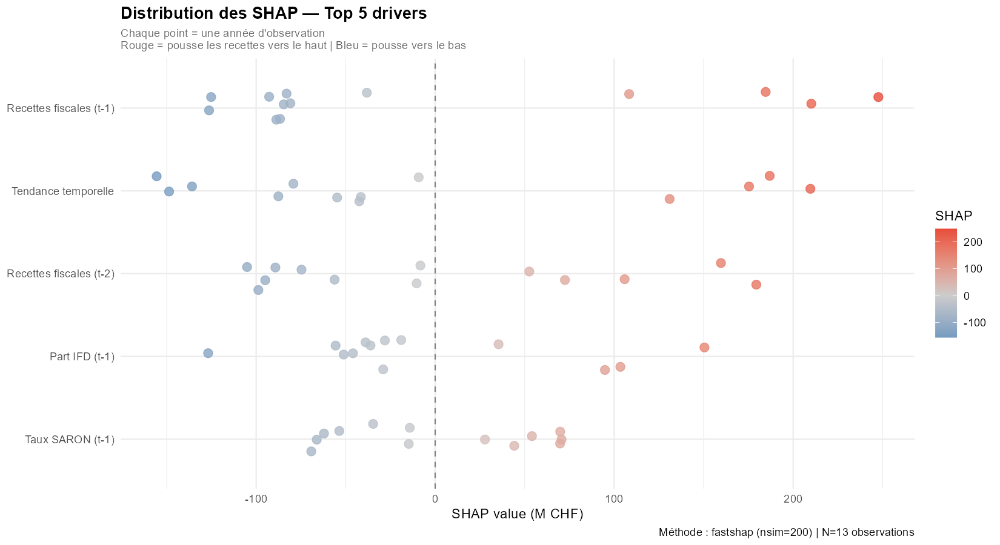
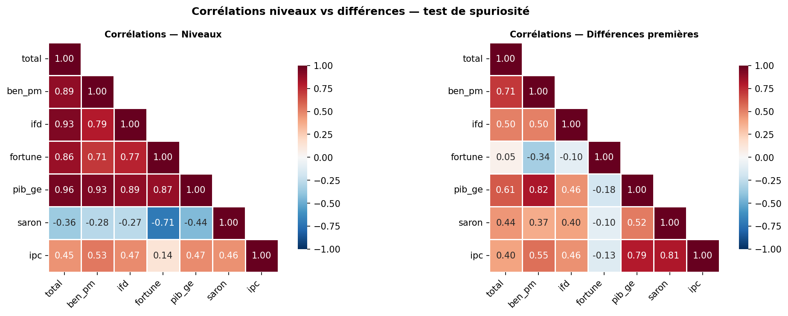

# Recettes fiscales genevoises — Analyse et prévision 2007–2024

**Auteur** : Frat DAG  
**Date** : Avril 2026  
**Données** : OCSTAT T18.02.1.15, OFS Comptes régionaux, BNS data.snb.ch  
**Langages** : R 4.x | Python 3.11

---

## La question de départ

Peut-on prévoir les recettes fiscales d'un canton suisse avec uniquement
des données publiques ? Et si oui, qu'est-ce que les données nous apprennent
vraiment — et qu'est-ce qu'elles ne permettent pas de faire ?

C'est la question centrale de ce projet. La réponse honnête est : **oui,
partiellement, avec des limites importantes qu'on documente au fur et à mesure.**
Ce README vous guide à travers chaque étape de l'analyse, en expliquant
non seulement ce qu'on a fait, mais pourquoi on l'a fait — et ce qu'on
aurait fait différemment avec de meilleures données.

---

## Encadré RFFA — À lire en premier

Avant de plonger dans les chiffres, il faut comprendre un événement
qui bouleverse toute la lecture des données après 2022.

La **Réforme fiscale et financement de l'AVS (RFFA)** est une réforme
**fédérale** entrée en vigueur le 1er janvier 2020. Elle s'applique à
tous les cantons suisses, mais ses effets sur les recettes fiscales
varient considérablement selon la structure économique de chaque canton.
Elle a supprimé les anciens régimes fiscaux préférentiels cantonaux —
des statuts spéciaux qui permettaient à certaines multinationales de
payer moins d'impôts — et les a remplacés par des instruments conformes
aux standards internationaux de l'OCDE, notamment la patent box
(réduction d'impôt sur les revenus de brevets) et les déductions R&D.

**Pourquoi Genève est particulièrement exposée ?**
Genève concentre une proportion exceptionnelle de sièges de multinationales
par rapport à sa taille — notamment dans le négoce de matières premières
(Vitol, Gunvor, Mercuria), la finance et les organisations internationales.
L'impôt sur le bénéfice des personnes morales genevois est structurellement
sensible aux profits de ces grandes entreprises — bien plus que dans
d'autres cantons.

**Pourquoi une rupture en 2022–2023 et pas en 2020 ?**
Deux effets se combinent : d'abord un délai de transition de deux ans
pendant lequel les entreprises ont adapté leurs structures fiscales.
Ensuite, des bénéfices exceptionnels post-COVID dans les secteurs
surreprésentés à Genève ont été imposés dans le nouveau régime,
produisant une hausse brutale des recettes.

**Ce qu'on peut affirmer, ce qu'on ne peut pas :**
La hausse de 2022–2023 est *partiellement* attribuable à la RFFA.
On ne peut pas la décomposer précisément sans données désagrégées
par type de contribuable — ces données ne sont pas publiques.
On traite donc la RFFA comme un choc structurel documenté,
qu'on capture via une variable indicatrice dans nos modèles.

Sources : AFC (estv.admin.ch), Canton de Genève (ge.ch),
OCDE Pilier 2 (oecd.org), OCSTAT (statistique.ge.ch)

---

## Glossaire et abréviations

Pour faciliter la lecture, voici les termes et abréviations utilisés
dans ce projet, dans l'ordre où ils apparaissent.

**Organismes et sources**
- **OCSTAT** — Office Cantonal de la STATistique du Canton de Genève
- **OFS** — Office Fédéral de la Statistique (Suisse)
- **BNS** — Banque Nationale Suisse
- **AFC** — Administration Fédérale des Contributions

**Termes fiscaux**
- **IR** — Impôt sur le Revenu des personnes physiques
- **PP** — Personnes Physiques (contribuables individuels)
- **PM** — Personnes Morales (entreprises, sociétés)
- **IFD** — Impôt Fédéral Direct — impôt prélevé par la Confédération
  dont une part est redistribuée aux cantons
- **RFFA** — Réforme Fiscale et Financement de l'AVS (voir encadré ci-dessus)
- **enreg_timbre** — "Produits de l'enregistrement et timbre" selon
  la nomenclature exacte OCSTAT — agrège les droits de mutation
  immobiliers, les droits de timbre et autres droits d'enregistrement

**Termes économiques**
- **PIB** — Produit Intérieur Brut — mesure de la richesse produite
  sur un territoire donné
- **SARON** — Swiss Average Rate Overnight — taux d'intérêt de référence
  suisse calculé quotidiennement par la BNS (voir section Données)
- **TCAM** — Taux de Croissance Annuel Moyen — croissance moyenne
  par an sur toute la période, exprimée en pourcentage
- **CV** — Coefficient de Variation — mesure de la volatilité d'une série,
  exprimée en pourcentage. Plus le CV est élevé, plus la série est
  imprévisible d'une année à l'autre

**Termes statistiques**
- **I(1)** — Série intégrée d'ordre 1 — une série dont les valeurs
  dérivent dans le temps (voir section Tests statistiques)
- **Stationnarité** — propriété d'une série dont la moyenne et la
  variance restent stables dans le temps
- **Rupture structurelle** — changement brutal et durable dans le
  comportement d'une série (ex : la RFFA en 2022)
- **Dummy variable** — variable binaire qui vaut 1 quand un événement
  s'est produit, 0 sinon
- **Cointégration** — relation de long terme stable entre plusieurs
  séries qui dérivent chacune individuellement
- **RMSE** — Root Mean Square Error — erreur quadratique moyenne,
  mesure standard de la précision d'un modèle
- **IC** — Intervalle de Confiance

**Modèles statistiques**
- **ARIMA** — AutoRegressive Integrated Moving Average
- **ARIMAX** — ARIMA avec variables eXogènes
- **ETS** — Error, Trend, Seasonality
- **VAR** — Vecteur AutoRégressif

**Méthodes d'analyse**
- **SHAP** — SHapley Additive exPlanations
- **Walk-forward** — méthode de validation qui entraîne un modèle
  sur le passé et le teste sur le futur, en avançant année par année
- **ADF** — test d'Augmented Dickey-Fuller
- **PP** — test de Phillips-Perron
- **KPSS** — test de Kwiatkowski-Phillips-Schmidt-Shin

---

## Données — Pourquoi ces sources, pourquoi ces choix

### Ce qui était disponible et ce qu'on a retenu

| Source | Série | Période | N |
|--------|-------|---------|---|
| OCSTAT T18.02.1.15 | Recettes fiscales GE (20 postes) | 2007–2024 | 18 |
| OFS Comptes régionaux | PIB nominal Genève | 2008–2022 | 15 (2022=provisoire) |
| BNS data.snb.ch | SARON (mensuel → annuel) | 2007–2024 | 18 |
| OFS via BNS | IPC total suisse (mensuel → annuel) | 2007–2024 | 18 |

La contrainte principale de ce projet est simple : **N=18 observations
annuelles**. L'OCSTAT publie les recettes fiscales cantonales en résolution
annuelle uniquement. C'est une contrainte de la source, pas un choix.

### Pourquoi le SARON et pas le taux directeur BNS ou le LIBOR ?

Le **taux directeur BNS** n'existe sous sa forme actuelle que depuis 2019.
Le **LIBOR** a été abandonné entre 2021 et 2023 et remplacé par le SARON.
Le **SARON** couvre toute notre période 2007–2024 et est la référence
officielle depuis la fin du LIBOR. C'est le seul choix cohérent.

### Pourquoi le PIB genevois s'arrête en 2022 ?

Les comptes régionaux OFS sont publiés avec un délai de 2 à 3 ans.
Le PIB genevois n'est pas utilisé comme régresseur dans les modèles
de prévision pour cette raison.

### Note sur la nomenclature IR

À partir de 2012, l'OCSTAT a séparé les impôts à la source de l'IR.
La baisse apparente de l'IR est un artefact comptable. On utilise
`pp_total` comme proxy cohérent sur toute la période 2007–2024.

---

## Résumé de l'approche

Ce projet suit une **approche inductive** : les données posent les questions,
les questions déterminent les tests, les tests déterminent les modèles.

**La démarche en cinq étapes :**
1. On regarde les données sans hypothèse — qu'est-ce qu'elles nous disent ?
2. On teste formellement ce qu'on a observé visuellement
3. On construit des modèles du plus simple au plus complexe
4. On analyse quelles variables expliquent les variations
5. On valide les modèles sur des données qu'ils n'ont pas vues

---

## Structure du projet

```
recettes-fiscales-genevoises/
├── README.md
├── R/
│   ├── scripts/
│   │   ├── 01_exploration.R
│   │   ├── 02_tests.R
│   │   ├── 03_modeles.R
│   │   ├── 04_shap.R
│   │   └── 04b_walkforward.R
│   └── figures/
│       ├── 01_total_evolution.png
│       ├── 01_decomposition.png
│       ├── 02_stationnarite_visuelle.png
│       ├── 03_comparaison_modeles.png
│       ├── 03_residus_modele_retenu.png
│       ├── 04_shap_importance.png
│       ├── 04_shap_beeswarm.png
│       ├── 04_shap_vs_rf_importance.png
│       ├── 04b_walkforward.png
│       └── 04b_erreurs_walkforward.png
└── Python/
    ├── notebooks/
    │   ├── 01_exploration.ipynb
    │   ├── 02_tests.ipynb
    │   ├── 03_modeles.ipynb
    │   ├── 04_shap.ipynb
    │   └── 04b_walkforward.ipynb
    └── figures/
        ├── 01_total_evolution_py.png
        ├── 01_decomposition_py.png
        ├── 01_correlations_py.png
        ├── 02_stationnarite_visuelle_py.png
        ├── 03_comparaison_modeles_py.png
        ├── 03_residus_modele_retenu_py.png
        ├── 04_shap_importance_py.png
        ├── 04_shap_beeswarm_py.png
        ├── 04_shap_vs_rf_importance_py.png
        ├── 04b_walkforward_py.png
        └── 04b_erreurs_walkforward_py.png
```

---

## 1. Exploration (script 01 / notebook 01)

### Ce qu'on cherche à cette étape

Regarder les données telles qu'elles sont avant tout test ou modèle.
On cherche des tendances, des anomalies, des ruptures visuelles.

### Ce que les données nous montrent


Les recettes fiscales genevoises ont augmenté de 5'971M CHF en 2007
à 9'269M CHF en 2024, soit un TCAM de +2.62%/an.


La croissance est portée par le bénéfice PM (+3.97%/an) et l'IFD
(+5.18%/an). L'IR recule nominalement (-0.49%/an) — artefact de
nomenclature OCSTAT 2012, pas un phénomène économique réel.

**La croissance fiscale genevoise repose structurellement sur les
entreprises, pas sur les ménages.**

**Les années atypiques :**
- **2010 : -6.4%** — contrecoup de la crise financière de 2008
- **2018 : +8.0%** — premier signal d'une recomposition fiscale
- **2020 : +1.2%** — le COVID n'a pas produit de rupture fiscale
- **2022 : +17.8%** — rupture majeure liée à la RFFA

**Volatilité relative des composantes (CV) :**

| Composante | CV | Interprétation |
|-----------|-----|----------------|
| IR | 9.7% | Très stable — suit l'emploi |
| PP total | 12.8% | Stable |
| Ben_pm | 31.7% | Volatile — suit les cycles de bénéfices |
| Fortune | 30.0% | Volatile |
| Enreg. et timbre | 25.4% | Modérément volatile |
| Successions | 37.8% | Très volatile — outlier 2009 |
| IFD | 40.8% | Très volatile — amplifiée par la RFFA |

---

## 2. Tests statistiques (script 02 / notebook 02)

### Pourquoi tester avant de modéliser ?

Les tests statistiques répondent à des questions fondamentales :
les séries dérivent-elles dans le temps ? Y a-t-il eu des ruptures
réelles ? Les variables sont-elles vraiment liées ou est-ce une illusion ?

### Q7 — Pourquoi l'IR décroît-il en tendance ?

En 2012, l'OCSTAT a séparé les impôts à la source de l'IR.
La baisse de l'IR est un artefact comptable. On utilise `pp_total`
comme proxy cohérent sur 2007–2024.

### Q1 — Les séries sont-elles stationnaires ?

Une série **stationnaire** oscille autour d'une moyenne stable.
Une série **I(1)** dérive dans le temps sans ancrage fixe.
Modéliser une série I(1) sans le savoir produit des résultats
qui semblent solides mais ne valent rien en pratique.

Avec N=18, on triangule trois tests (ADF, PP, KPSS) pour robustesse.
On a aussi utilisé Zivot-Andrews qui identifie endogènement le point
de rupture le plus probable.


| Série | Conclusion |
|-------|-----------|
| Total recettes | I(1) — confirmé trois tests |
| PP total | I(1) — confirmé trois tests |
| Fortune PP | I(1) — confirmé trois tests |
| IFD | I(1) — KPSS confirme malgré ADF ambigu |
| Bénéfice PM | Ambigu — traité comme I(1) |
| Enreg. et timbre | Ambigu — régresseur potentiel uniquement |

Zivot-Andrews détecte une rupture endogène en 2018 (total) et 2019
(bénéfice PM) — cohérent avec le bond de +8% observé en 2018.

### Q2 — Ruptures structurelles

| Année | F-stat | p-value | Conclusion |
|-------|--------|---------|-----------|
| 2010 | 4.197 | 0.037 | **Rupture confirmée** |
| 2020 | 18.59 | ≈0 | **Rupture confirmée** |
| 2022 | — | — | Non testable — traitée via dummy_rffa |

### Q3 — Outlier successions 2009

308M vs médiane 188M (1.7σ). Successions exclues de la modélisation.

### Q4 — Cointégration

Test de Johansen : divergence trace/eigen → **VAR en différences**
(pas de VECM).

### Q5 — Corrélations en différences

| Variable | Corrélation niveaux | Corrélation différences | Verdict |
|----------|---------------------|------------------------|---------|
| Fortune PP | 0.86 | **0.05** | Spurieuse — exclue |
| Bénéfice PM | 0.89 | 0.71 | Réelle |
| PIB genevois | 0.96 | 0.61 | Réelle et structurelle |
| IFD | 0.93 | 0.50 | Réelle |

### Q6 — Dummies

| Dummy | Coefficient | p-value | Décision |
|-------|-------------|---------|---------|
| dummy_rffa | +1729M | ≈0 | **Intégrée** |
| dummy_covid | +153M | 0.61 | Exclue |

La dummy_covid non significative confirme la résilience genevoise au COVID.

---

## 3. Modèles (script 03 / notebook 03)

### Stratégie

Du plus simple au plus complexe. Chaque modèle doit battre le précédent.

### Comparaison des quatre modèles


| Modèle | RMSE training | Ljung-Box p | Statut |
|--------|--------------|-------------|--------|
| ARIMA(0,1,0) + drift | 391M | 0.613 | Baseline |
| ETS(M,N,N) | 434M | 0.683 | Inférieur |
| **ARIMAX(0,1,0) + dummy_rffa** | **283M** | **0.748** | **Retenu** |
| VAR(1) en différences | — | — | Exploratoire |


*Les résidus oscillent aléatoirement autour de zéro — modèle bien spécifié.*

### Prévisions 2025–2027

| Année | Point forecast | IC 80% | IC 95% |
|-------|---------------|--------|--------|
| 2025 | 9'269M | [8'885 – 9'653] | [8'681 – 9'857] |
| 2026 | 9'269M | [8'726 – 9'812] | [8'438 – 10'100] |
| 2027 | 9'269M | [8'604 – 9'934] | [8'251 – 10'287] |

Le plateau à 9'269M reflète une hypothèse de stabilisation post-RFFA.

---

## 4. Analyse SHAP des drivers (script 04 / notebook 04)

### Le but

Les modèles disent *ce que* les recettes vont faire. Cette section
répond au *pourquoi* elles bougent.




| Rang | Variable | SHAP moyen |
|------|----------|-----------|
| 1 | Recettes fiscales (t-1) | 120M |
| 2 | Tendance temporelle | 112M |
| 3 | Recettes fiscales (t-2) | 85M |
| 4 | Part IFD (t-1) | 63M |
| 5 | Taux SARON (t-1) | 50M |
| 6 | Bénéfice PM (t-1) | 28M |
| 7 | Inflation IPC (t-1) | 5M |
| 8 | Effet RFFA 2022+ | 0M* |

*dummy_rffa = 0 en training → RF ne peut pas apprendre l'effet.
L'effet RFFA est capturé par l'ARIMAX (+1398M, p≈0).*


*Les deux méthodes donnent le même classement — robustesse confirmée.*

---

## 5. Validation walk-forward (script 04b / notebook 04b)

### Pourquoi ce script séparé — soyons honnêtes

Ce script n'était pas prévu initialement. On s'est rendu compte en fin
de projet que les modèles avaient été évalués sur leurs données
d'entraînement uniquement. Cette lacune a été corrigée ici.

### Prédictions vs réalisations


| Année | Réalisé | ARIMA | ETS | ARIMAX | RF |
|-------|---------|-------|-----|--------|----|
| 2017 | 6'641M | 6'590M | 6'496M | n/a | 6'434M |
| 2018 | 7'173M | 6'708M | 6'585M | n/a | 6'499M |
| 2019 | 7'363M | 7'282M | 7'022M | n/a | 6'909M |
| 2020 | 7'454M | 7'479M | 7'350M | n/a | 6'999M |
| 2021 | 7'871M | 7'568M | 7'454M | n/a | 7'078M |
| 2022 | 9'269M | 8'007M | 7'871M | n/a | 7'530M |
| 2023 | 9'734M | 9'489M | 9'269M | 9'269M | 8'555M |
| 2024 | 9'269M | 9'969M | 9'734M | 9'734M | 9'150M |


### RMSE walk-forward

**Hors RFFA (2017–2021) :**

| Modèle | RMSE |
|--------|------|
| **ARIMA** | **252M** |
| ETS | 365M |
| RF | 555M |
| ARIMAX | exclu† |

**Toutes années (2017–2024) :**

| Modèle | RMSE |
|--------|------|
| ARIMAX | 465M |
| ARIMA | 555M |
| ETS | 618M |
| RF | 864M |

†ARIMAX non estimable avant 2022 sur fenêtre hors RFFA.

---

## Ce que ce projet nous apprend

**1. La croissance fiscale genevoise repose sur les entreprises, pas sur les ménages.**
Bénéfice PM +3.97%/an, IFD +5.18%/an — contre IR -0.49%/an (artefact nomenclature).

**2. La RFFA représente un choc de +1398M CHF sur les recettes annuelles.**
Estimé via ARIMAX (p≈0) — non décomposable sans données désagrégées.

**3. La fortune PP est un piège statistique.**
Corrélation 0.86 en niveaux → 0.05 en différences. Entièrement spurieuse.

**4. Genève a traversé le COVID sans rupture fiscale.**
dummy_covid non significative (p=0.61) — résilience confirmée statistiquement.

**5. La mémoire fiscale domine les variations annuelles.**
Recettes (t-1) = premier driver SHAP (120M).

**6. Le SARON est un signal du cycle économique, pas une cause directe.**
La corrélation passe par le cycle de l'emploi, pas par une causalité directe.

---

## Traduction Python

L'ensemble du pipeline a été traduit en Python 3.11 (Jupyter Notebooks)
pour élargir l'accessibilité du projet à un public data science.

**Environnement :** Miniconda, environnement `fiscal_ge`, Python 3.11  
**Packages :** pandas, numpy, matplotlib, seaborn, statsmodels,
scikit-learn, shap

Les notebooks reproduisent fidèlement les analyses R. Quelques différences
d'implémentation sont documentées ci-dessous.

### Graphiques Python — points forts

La traduction Python a produit des visualisations parfois supérieures
à la version R :

**Matrice de corrélation (notebook 01) :**



*La heatmap seaborn côte à côte (niveaux vs différences premières) est
plus lisible que l'équivalent R — meilleur contraste, valeurs annotées,
comparaison visuelle immédiate de la corrélation spurieuse de la fortune.*

**Erreurs walk-forward (notebook 04b) :**


*Ce graphique n'existait pas dans la version R. Les zones colorées
(vert = hors RFFA, rouge = période RFFA) et les erreurs exprimées
en milliards rendent immédiatement lisible qui sous-estime et quand.*

---

## Différences R vs Python — documentées

Ces différences sont inhérentes aux implémentations des packages,
pas à des erreurs d'analyse. Les conclusions restent identiques.

### 1. Drift ARIMAX — R plus direct

En R, `forecast()` gère automatiquement la réintégration du drift
dans les prévisions ARIMAX. En Python, `statsmodels` nécessite une
reconstruction manuelle des prévisions depuis la dernière valeur
observée — ce qui introduit des choix sur le traitement de la dummy_rffa
dans les périodes futures.

Pour ce type d'analyse sur séries temporelles courtes avec rupture
structurelle, **R reste plus direct et plus robuste**. Le code de
reconstruction Python est disponible dans le notebook 03 mais n'est
pas intégré dans le pipeline principal par souci de clarté.

| Métrique | R | Python |
|---------|---|--------|
| RMSE ARIMAX training | 283M | 267M |
| Coeff dummy_rffa | +1398M | +1279M |
| Prévision 2025 | 9'269M (plateau) | 9'388M (légère croissance) |

### 2. Zivot-Andrews — R meilleur

Le package `urca` de R (`ur.za`) gère les petits échantillons mieux
que `statsmodels` en Python. Sur N=18, Python échoue sur ben_pm et
ifd (matrice auxiliaire singulière par manque de degrés de liberté).
Les conclusions du script R restent la référence pour ce test.

| Série | R (ur.za) | Python (statsmodels) |
|-------|-----------|---------------------|
| Total recettes | Rupture 2018, rejet H0 ✓ | Stat=-4.76, non rejet |
| Bénéfice PM | Rupture 2019, rejet H0 ✓ | Erreur — matrice singulière |
| IFD | Non rejet | Erreur — matrice singulière |

### 3. Heatmap de corrélation — Python meilleur

La heatmap `seaborn` est nettement plus lisible que `corrplot` en R
sur ce type de données — voir graphique ci-dessus.

### 4. p-values KPSS — légère divergence

PP total : KPSS p=0.042 en Python vs confirmé en R — dû à la sélection
automatique des lags. Conclusion I(1) identique dans les deux cas.

---

## Limitations

**Taille de l'échantillon (N=18)**
La puissance des tests est faible. Les conclusions sont des hypothèses
de travail validées par triangulation, pas des verdicts définitifs.

**Données annuelles uniquement**
Contrainte OCSTAT. Des données trimestrielles rendraient tous les tests
beaucoup plus robustes.

**Effet RFFA non décomposé**
La dummy_rffa capture un effet global de +1398M. La décomposition
nécessiterait des données désagrégées non disponibles publiquement.

**SHAP values instables**
N=13 en training. Indicateurs de direction, pas mesures précises.

**Hypothèse de persistance RFFA**
Les prévisions 2025–2027 supposent dummy=1. Si les bénéfices se
normalisent, les recettes pourraient revenir vers la tendance pré-RFFA.

**PIB disponible jusqu'en 2022 seulement**
Non utilisé comme régresseur dans les modèles de prévision.

---

## Améliorations possibles

### Avec de nouvelles données
- Données trimestrielles (internes AFC/SCC)
- Modèle de panel multi-cantonal (GE, ZH, VD, BS)
- Taux de change EUR/CHF, USD/CHF
- Masse salariale cantonale (OFS)
- Données désagrégées par contribuable (AFC)

### Avec les données actuelles
- Graphiques interactifs plotly
- Approche bayésienne sur petit échantillon
- Intervalles de prévision par bootstrap

### Perspectives long terme
- Prophet si données mensuelles disponibles
- Modèle structurel bayésien (BSTS)

---

## Reproductibilité

**R :**
```r
setwd("votre/repertoire/de/travail")
source("R/scripts/01_exploration.R")
source("R/scripts/02_tests.R")
source("R/scripts/03_modeles.R")
source("R/scripts/04_shap.R")
source("R/scripts/04b_walkforward.R")
```

**Python :**
```bash
conda create -n fiscal_ge python=3.11
conda activate fiscal_ge
pip install jupyter pandas numpy matplotlib seaborn statsmodels scikit-learn shap
jupyter notebook
```

Ouvrir les notebooks dans l'ordre depuis le dossier `Python/notebooks/`.

`set.seed(42)` / `random_state=42` dans tous les blocs avec composante aléatoire.

---

## Contact

**Frat DAG**  
Email : fratdag@gmail.com  
LinkedIn : https://www.linkedin.com/in/fratdag/
