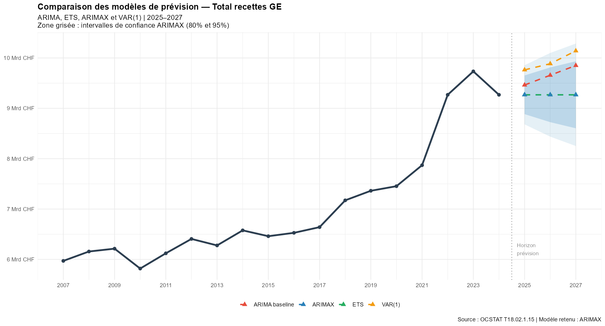
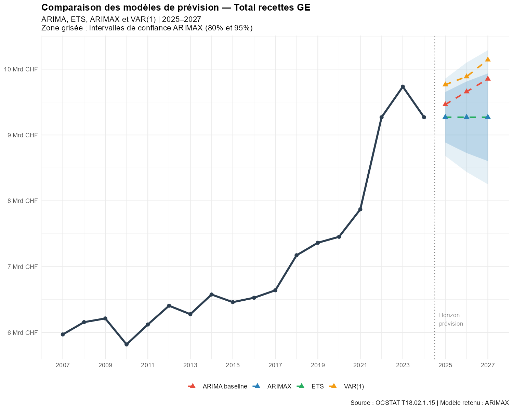
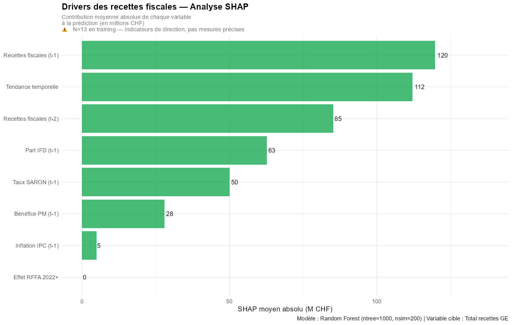
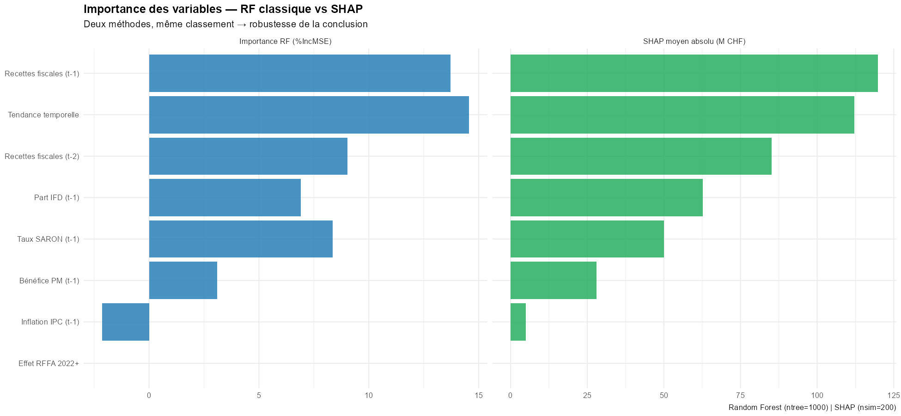
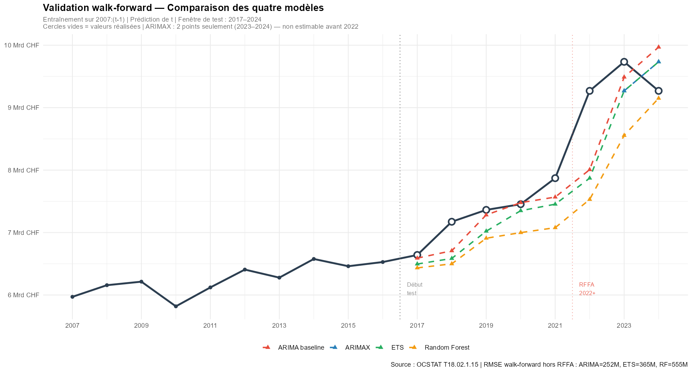
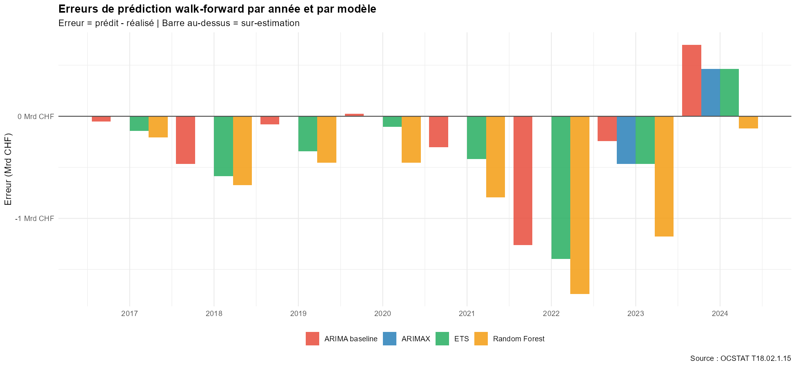

# Recettes fiscales genevoises — Analyse et prévision 2007–2024

**Auteur** : Frat DAG  
**Date** : Avril 2026  
**Données** : OCSTAT T18.02.1.15, OFS Comptes régionaux, BNS data.snb.ch  
**Langage** : R 4.x

---

## La question de départ

Peut-on prévoir les recettes fiscales d'un canton suisse avec uniquement
des données publiques ? Et si oui, qu'est-ce que les données nous apprennent
vraiment — et qu'est-ce qu'elles ne permettent pas de faire ?

C'est la question centrale de ce projet. La réponse honnête est : **oui,
partiellement, avec des limites importantes qu'on documente au fur et à mesure.**
Ce README vous guide à travers chaque étape de l'analyse, en expliquant
non seulement ce qu'on a fait, mais pourquoi on l'a fait — et ce qu'on
aurait fait différemment avec de meilleures données.

---

## Encadré RFFA — À lire en premier

Avant de plonger dans les chiffres, il faut comprendre un événement
qui bouleverse toute la lecture des données après 2022.

La **Réforme fiscale et financement de l'AVS (RFFA)** est entrée en vigueur
le 1er janvier 2020. Elle a supprimé les anciens régimes fiscaux préférentiels
cantonaux — des statuts spéciaux qui permettaient à certaines multinationales
de payer moins d'impôts — et les a remplacés par des instruments conformes
aux standards internationaux de l'OCDE, notamment la patent box
(réduction d'impôt sur les revenus de brevets) et les déductions R&D.

**Pourquoi une rupture en 2022–2023 et pas en 2020 ?**
Deux effets se combinent : d'abord un délai de transition de deux ans
pendant lequel les entreprises ont adapté leurs structures. Ensuite,
des bénéfices exceptionnels post-COVID dans les secteurs surreprésentés
à Genève — négoce de matières premières (Trafigura, Vitol, Gunvor),
pharmacie (Roche, Novartis) et finance. Ces bénéfices record ont été
imposés dans le nouveau régime, produisant une hausse brutale des recettes.

**Pourquoi Genève est particulièrement touchée ?**
Genève concentre une proportion exceptionnelle de sièges de multinationales
par rapport à sa taille. L'impôt sur le bénéfice des personnes morales
genevois est structurellement sensible aux profits de ces grandes entreprises
— bien plus que dans d'autres cantons.

**Ce qu'on peut affirmer, ce qu'on ne peut pas :**
La hausse de 2022–2023 est *partiellement* attribuable à la RFFA.
On ne peut pas la décomposer précisément sans données désagrégées
par type de contribuable — ces données ne sont pas publiques.
On traite donc la RFFA comme un choc structurel documenté,
qu'on capture via une variable indicatrice (dummy) dans nos modèles.

Sources : AFC (estv.admin.ch), Canton de Genève (ge.ch),
OCDE Pilier 2 (oecd.org), OCSTAT (statistique.ge.ch)

---

## Glossaire et abréviations

Pour faciliter la lecture, voici les termes et abréviations utilisés
dans ce projet, dans l'ordre où ils apparaissent.

**Organismes et sources**
- **OCSTAT** — Office Cantonal de la STATistique du Canton de Genève
- **OFS** — Office Fédéral de la Statistique (Suisse)
- **BNS** — Banque Nationale Suisse
- **AFC** — Administration Fédérale des Contributions

**Termes fiscaux**
- **IR** — Impôt sur le Revenu des personnes physiques
- **PP** — Personnes Physiques (contribuables individuels)
- **PM** — Personnes Morales (entreprises, sociétés)
- **IFD** — Impôt Fédéral Direct — impôt prélevé par la Confédération
  dont une part est redistribuée aux cantons
- **RFFA** — Réforme Fiscale et Financement de l'AVS (voir encadré ci-dessus)
- **enreg_timbre** — "Produits de l'enregistrement et timbre" selon
  la nomenclature exacte OCSTAT — agrège les droits de mutation
  immobiliers, les droits de timbre et autres droits d'enregistrement

**Termes économiques**
- **PIB** — Produit Intérieur Brut — mesure de la richesse produite
  sur un territoire donné
- **SARON** — Swiss Average Rate Overnight — taux d'intérêt de référence
  suisse calculé quotidiennement par la BNS (voir section Données)
- **TCAM** — Taux de Croissance Annuel Moyen — croissance moyenne
  par an sur toute la période, exprimée en pourcentage
- **CV** — Coefficient de Variation — mesure de la volatilité d'une série,
  exprimée en pourcentage. Plus le CV est élevé, plus la série est
  imprévisible d'une année à l'autre

**Termes statistiques**
- **I(1)** — Série intégrée d'ordre 1 — une série dont les valeurs
  dérivent dans le temps (voir section Tests statistiques)
- **Stationnarité** — propriété d'une série dont la moyenne et la
  variance restent stables dans le temps (voir section Tests statistiques)
- **Rupture structurelle** — changement brutal et durable dans le
  comportement d'une série (ex : la RFFA en 2022)
- **Dummy variable** — variable binaire qui vaut 1 quand un événement
  s'est produit, 0 sinon. Permet de capturer l'effet d'un choc
  dans un modèle statistique
- **Cointégration** — relation de long terme stable entre plusieurs
  séries qui dérivent chacune individuellement
- **RMSE** — Root Mean Square Error — erreur quadratique moyenne,
  mesure standard de la précision d'un modèle. Plus le RMSE est
  faible, plus le modèle est précis
- **IC** — Intervalle de Confiance — fourchette dans laquelle la
  vraie valeur a X% de chances de se trouver

**Modèles statistiques**
- **ARIMA** — AutoRegressive Integrated Moving Average — modèle de
  série temporelle qui prédit une valeur future à partir des valeurs
  passées et des erreurs passées
- **ARIMAX** — ARIMA avec variables eXogènes — ARIMA enrichi avec
  des variables externes (ici la dummy RFFA)
- **ETS** — Error, Trend, Seasonality — modèle alternatif à ARIMA
  qui décompose une série en niveau, tendance et saisonnalité
- **VAR** — Vecteur AutoRégressif — modèle qui capture les interactions
  entre plusieurs séries simultanément

**Méthodes d'analyse**
- **SHAP** — SHapley Additive exPlanations — méthode qui mesure
  la contribution de chaque variable à chaque prédiction individuelle
- **Walk-forward** — méthode de validation qui entraîne un modèle
  sur le passé et le teste sur le futur, en avançant année par année
  (voir section Walk-forward)
- **ADF** — test d'Augmented Dickey-Fuller — test de stationnarité
- **PP** — test de Phillips-Perron — test de stationnarité alternatif
- **KPSS** — test de Kwiatkowski-Phillips-Schmidt-Shin — test de
  stationnarité qui teste dans la direction opposée à ADF et PP

---

## Données — Pourquoi ces sources, pourquoi ces choix

### Ce qui était disponible et ce qu'on a retenu

| Source | Série | Période | N |
|--------|-------|---------|---|
| OCSTAT T18.02.1.15 | Recettes fiscales GE (20 postes) | 2007–2024 | 18 |
| OFS Comptes régionaux | PIB nominal Genève | 2008–2022 | 15 |
| BNS data.snb.ch | SARON (mensuel → annuel) | 2007–2024 | 18 |
| OFS via BNS | IPC total suisse (mensuel → annuel) | 2007–2024 | 18 |

La contrainte principale de ce projet est simple : **N=18 observations
annuelles**. L'OCSTAT publie les recettes fiscales cantonales en résolution
annuelle uniquement — pas de données trimestrielles ou mensuelles disponibles
publiquement. C'est une contrainte de la source, pas un choix.

Avec 18 observations, la puissance statistique de nos tests est faible.
On l'assume et on le documente partout — c'est précisément pourquoi
on triangule plusieurs tests plutôt que d'en utiliser un seul.

### Pourquoi le SARON et pas le taux directeur BNS ou le LIBOR ?

Le **taux directeur BNS** n'existe sous sa forme actuelle que depuis 2019 —
il ne couvre pas notre période d'analyse 2007–2024. Le **LIBOR** (London
Interbank Offered Rate) a été abandonné progressivement entre 2021 et 2023
et remplacé précisément par le SARON en Suisse. Le **SARON** (Swiss Average
Rate Overnight) couvre toute notre période 2007–2024, est calculé
quotidiennement par la BNS à partir de transactions réelles sur le marché
monétaire suisse, et est la référence officielle depuis la fin du LIBOR.
C'est donc le seul choix cohérent sur l'ensemble de la période.

### Pourquoi le PIB genevois s'arrête en 2022 ?

Les comptes régionaux OFS sont publiés avec un délai de 2 à 3 ans.
En avril 2026, les données disponibles s'arrêtent en 2022 (provisoire).
C'est pourquoi le PIB n'est pas utilisé comme régresseur dans les modèles
de prévision — on ne peut pas prévoir 2025–2027 avec une variable
dont on ne connaît pas les valeurs récentes.

### Note sur la nomenclature IR

À partir de 2012, l'OCSTAT a séparé les impôts à la source de l'impôt
sur le revenu dans sa nomenclature. Avant 2012, les deux étaient regroupés.
Résultat : l'IR semble baisser nominalement sur 2007–2024, alors qu'il
s'agit d'un artefact comptable. On utilise `pp_total` (total des impôts
des personnes physiques) comme proxy cohérent sur toute la période.

---

## Résumé de l'approche — Avant de rentrer dans le vif du sujet

Ce projet suit une **approche inductive** : les données posent les questions,
les questions déterminent les tests, les tests déterminent les modèles.
On ne choisit pas les méthodes avant d'avoir regardé les données.

**Ce qu'on cherche à savoir :**
Les recettes fiscales genevoises sont-elles prévisibles ? Quels sont
les facteurs qui les font bouger d'une année à l'autre ? La RFFA
a-t-elle vraiment changé la structure des recettes ?

**Ce qu'on sait d'avance qui va poser problème :**
N=18 est un échantillon très petit pour des méthodes économétriques
sérieuses. Les tests statistiques manquent de puissance. Les modèles
risquent d'être instables. La rupture de 2022 est si récente (3 observations)
qu'elle est difficile à traiter formellement. On le sait, on l'assume,
et on choisit de le faire quand même — parce que documenter honnêtement
les limites d'une analyse sur données publiques réelles est plus utile
que de ne rien faire.

**La démarche en cinq étapes :**
1. On regarde les données sans hypothèse — qu'est-ce qu'elles nous disent ?
2. On teste formellement ce qu'on a observé visuellement
3. On construit des modèles du plus simple au plus complexe
4. On analyse quelles variables expliquent les variations
5. On valide les modèles sur des données qu'ils n'ont pas vues

---

## Structure du projet

```
├── 01_exploration.R       # Exploration et statistiques descriptives
├── 02_tests.R             # Tests de stationnarité, ruptures, cointégration
├── 03_modeles.R           # ARIMA, ETS, ARIMAX, VAR
├── 04_shap.R              # Random Forest et analyse SHAP des drivers
├── 04b_walkforward.R      # Validation walk-forward sur les quatre modèles
└── README.md
```

---

## 1. Exploration (script 01)

### Ce qu'on cherche à cette étape

Avant tout test, avant tout modèle : regarder les données telles qu'elles sont.
On cherche des tendances, des anomalies, des ruptures visuelles, et des questions
que les données posent naturellement. Ces questions structureront toute
la suite de l'analyse.

### Ce que les données nous montrent


Les recettes fiscales genevoises ont augmenté de 5'971M CHF en 2007
à 9'269M CHF en 2024, soit un taux de croissance annuel moyen (TCAM)
de +2.62%/an. Mais cette moyenne cache des trajectoires très différentes
selon les composantes.


**Ce que le graphique révèle immédiatement :**

La croissance n'est pas portée par tout le monde de la même façon.
L'impôt sur le revenu des personnes physiques (IR) — la composante
la plus volumineuse — recule nominalement sur la période (-0.49%/an).
C'est un artefact de nomenclature OCSTAT 2012 (voir section Données),
pas un phénomène économique réel. En revanche, l'impôt sur le bénéfice
des personnes morales (ben_pm) croît à +3.97%/an et la part cantonale
de l'IFD à +5.18%/an. Ce sont eux qui tirent le total vers le haut.

**Ce que ça signifie en pratique :**
La croissance des recettes fiscales genevoises repose structurellement
sur les entreprises, pas sur les ménages. Genève est fiscalement
dépendante des bénéfices de ses grandes entreprises — ce qui explique
à la fois sa prospérité en période de bons résultats corporatifs
et sa vulnérabilité aux cycles économiques des multinationales.

**Les années atypiques :**
- **2010 : -6.4%** — contrecoup de la crise financière de 2008
- **2018 : +8.0%** — bond inexpliqué par la tendance, premier signal
  d'une recomposition fiscale
- **2020 : +1.2%** — le COVID n'a pas produit de rupture fiscale à Genève,
  ce qui témoigne de la résilience du tissu économique genevois
- **2022 : +17.8%** — rupture majeure liée à la RFFA (voir encadré)

**Volatilité relative des composantes (CV) :**

| Composante | CV | Interprétation |
|-----------|-----|---------------|
| IR | 9.7% | Très stable — suit l'emploi |
| PP total | 12.8% | Stable |
| Ben_pm | 31.7% | Volatile — suit les cycles de bénéfices |
| Fortune | 30.0% | Volatile |
| Droits de mutation | 25.4% | Modérément volatile |
| Successions | 37.8% | Très volatile — outlier 2009 (308M vs médiane 188M) |
| IFD | 40.8% | Très volatile — amplifiée par la RFFA |

**Sept questions émergent de cette exploration :**
Ces questions structurent entièrement le script 02 — on ne teste
que ce que les données nous ont demandé de tester.

---

## 2. Tests statistiques (script 02)

### Pourquoi tester avant de modéliser ?

Construire un modèle sur des données qu'on ne comprend pas, c'est
construire une maison sans sonder le terrain. Les tests statistiques
de cette section répondent à des questions fondamentales : les séries
dérivent-elles dans le temps ? Y a-t-il eu des ruptures réelles ?
Les variables sont-elles vraiment liées ou est-ce une illusion ?

Les réponses déterminent directement quels modèles on peut utiliser
dans la section suivante. On ne choisit pas les modèles avant d'avoir
ces réponses.

### Q7 — Pourquoi l'IR décroît-il en tendance ? (traité en premier)

Cette question est traitée avant les tests de stationnarité parce qu'elle
conditionne tout le reste. Si l'IR baisse pour une raison comptable et non
économique, inclure l'IR brut dans nos tests et modèles introduit un biais
de mesure — comme mesurer une croissance en changeant d'unité à mi-parcours.

**Ce qu'on découvre :**
En 2012, l'OCSTAT a séparé les impôts à la source de l'IR dans sa
nomenclature. L'IR 2007–2011 incluait les impôts à la source.
L'IR 2012–2024 ne les inclut plus.

| Période | IR moyen |
|---------|---------|
| 2007–2011 (avec impôts à la source) | 3'186M |
| 2012–2024 (sans impôts à la source) | 2'731M |
| 2012–2024 (corrigé, avec impôts à la source) | 3'617M |

La baisse de l'IR est un artefact comptable. On utilise `pp_total`
(total des impôts des personnes physiques) comme proxy cohérent
sur toute la période 2007–2024.

### Q1 — Les séries sont-elles stationnaires ?

**Pourquoi c'est important :**
Une série **stationnaire** oscille autour d'une moyenne stable — comme
un pendule qui revient toujours à sa position d'équilibre. Une série
**non stationnaire** (ou I(1)) dérive dans le temps sans ancrage fixe —
comme un bateau sans ancre sur une mer agitée.

Si on modélise une série non stationnaire sans le savoir, on obtient
des résultats qui semblent solides mais qui sont en réalité du bruit.
Deux séries qui dérivent toutes les deux à la hausse vont sembler
fortement corrélées même si elles n'ont aucun lien réel — c'est
la **corrélation spurieuse**, l'un des pièges classiques de l'économétrie.

**Pourquoi trois tests et pas un seul ?**
Avec N=18 observations, aucun test pris seul n'est fiable — leur puissance
statistique est trop faible. En utilisant trois tests qui fonctionnent
différemment, on peut triangular les conclusions :

- **ADF (Augmented Dickey-Fuller)** : teste si la série a une "racine unitaire"
  (signe de non-stationnarité) en contrôlant pour l'autocorrélation
- **PP (Phillips-Perron)** : même objectif que l'ADF mais avec une
  correction différente — plus robuste à certaines formes d'irrégularités
- **KPSS** : teste dans la direction opposée — H0 est "la série est
  stationnaire". Si ADF dit "non stationnaire" ET KPSS dit "non stationnaire",
  la conclusion est beaucoup plus solide qu'avec un seul test

**Pourquoi pas d'autres tests ?**
On a aussi utilisé le test de **Zivot-Andrews**, qui a l'avantage d'identifier
endogènement (sans présupposer la date) le point de rupture le plus probable
dans la série. Contrairement au test de Chow (Q2) qui teste une date fixée
a priori, Zivot-Andrews dit "si une rupture existe, elle est probablement
quand ?". C'est particulièrement utile sur petit échantillon avec des
ruptures visuelles évidentes.


*Le graphique ci-dessus montre chaque série en niveau (à gauche) et après
différenciation (à droite). Une série différenciée stationnaire oscille
autour de zéro sans tendance — c'est ce qu'on cherche à confirmer.*

**Résultats de la triangulation ADF + PP + KPSS :**

| Série | Conclusion |
|-------|-----------|
| Total recettes | I(1) — confirmé par les trois tests |
| PP total | I(1) — confirmé par les trois tests |
| Fortune PP | I(1) — confirmé par les trois tests |
| IFD | I(1) — KPSS confirme malgré ADF ambigu |
| Bénéfice PM | Ambigu — traité comme I(1) car la rupture RFFA perturbe les tests |
| Enreg. et timbre | Ambigu — utilisé comme régresseur potentiel uniquement |

**Zivot-Andrews détecte :**
- Total recettes : rupture endogène en 2018 (position 12 dans la série)
- Bénéfice PM : rupture endogène en 2019 (position 13)
- IFD : pas de rupture structurelle claire

*Ces dates (2018–2019) sont cohérentes avec le bond de +8% observé
visuellement en 2018 — premier signal d'une recomposition fiscale
avant la rupture majeure de 2022.*

**Ce que ça implique pour la suite :**
Les séries fiscales principales sont I(1) — elles dérivent dans le temps.
On devra les différencier (calculer les variations annuelles plutôt que
les niveaux) avant de les modéliser. C'est cette conclusion qui détermine
directement le type de modèles qu'on peut utiliser dans le script 03.

### Q2 — Y a-t-il eu des ruptures structurelles confirmées ?

**Pourquoi c'est important :**
Une rupture structurelle est un changement brutal et durable dans le
comportement d'une série — comme si les règles du jeu avaient changé.
Si on ne la détecte pas et qu'on ne la traite pas, le modèle va essayer
d'expliquer la rupture avec la tendance normale, ce qui biaise toutes
les prévisions.

**Méthode — Test de Chow :**
Le test de Chow vérifie si les paramètres d'une régression changent
significativement avant et après un point de rupture choisi a priori.
On teste les années visuellement atypiques identifiées en Q1.

| Année testée | F-stat | p-value | Conclusion |
|-------------|--------|---------|-----------|
| 2010 | 4.197 | 0.037 | **Rupture confirmée** — contrecoup crise 2008 |
| 2020 | 18.59 | ≈0 | **Rupture confirmée** — mais direction inattendue |
| 2022 | — | — | Non testable — seulement 3 observations après 2022 |

*Note : 2020 montre une rupture statistiquement très significative
(F=18.59) mais dans le sens d'une résilience — les recettes n'ont
pas chuté comme on aurait pu l'attendre avec le COVID.
La rupture de 2022 ne peut pas être testée formellement avec le
test de Chow car il faut au minimum k+1 observations de chaque côté
du point de rupture. On la traite via une dummy variable en Q6.*

### Q3 — Comment traiter l'outlier des successions en 2009 ?

**Ce qu'on observe :**
Les droits de succession 2009 atteignent 308M CHF contre une médiane
de 188M sur toute la série — un écart de 1.7 sigma (1.7 fois l'écart-type).
Ce pic est probablement lié à des successions exceptionnelles réglées
dans le contexte post-crise financière de 2008–2009.

**Décision :** La série des successions est exclue de la modélisation
principale en raison de sa volatilité (CV=37.8%) et de cet outlier.
Une variable indicatrice (`dummy_succ_2009`) est créée en réserve
au cas où on voudrait l'inclure comme régresseur dans un modèle futur.

### Q4 — Les séries sont-elles liées sur le long terme ?

**Pourquoi c'est important :**
Si plusieurs séries I(1) sont **cointégrées** — c'est-à-dire qu'elles
partagent une relation de long terme stable malgré leurs dérives
individuelles — le modèle adapté est un VECM (Vector Error Correction
Model) qui capture cette relation. Sinon, on utilise un VAR en différences,
plus simple et plus conservateur.

**Méthode — Test de Johansen :**
Le test de Johansen est la méthode standard pour détecter la cointégration
entre plusieurs séries I(1). Il existe en deux versions :
le test trace et le test de la valeur propre maximale — les deux
testent la même chose mais avec des sensibilités différentes.

**Résultats :**
- Test trace : rejette H0 (suggère une cointégration)
- Test valeur propre max : ne rejette pas H0 à 5% (pas de cointégration)

Les deux tests divergent — ce qui arrive fréquemment sur petit échantillon.
Le test trace a tendance à sur-rejeter H0 sur N=13 observations effectives.
Par principe de prudence, on retient la conclusion du test valeur propre max
(plus conservateur) : **pas de cointégration confirmée → VAR en différences.**

### Q5 — Les corrélations observées sont-elles réelles ou illusoires ?

**Le piège de la corrélation spurieuse :**
Deux séries qui montent toutes les deux au fil du temps vont sembler
fortement corrélées — même si elles n'ont aucun lien causal. C'est
la corrélation spurieuse. Pour la détecter, on recalcule les corrélations
non pas sur les niveaux (les valeurs brutes) mais sur les **différences
premières** (les variations annuelles) — qui sont stationnaires.

Si une corrélation persiste en différences → la relation est réelle.
Si elle disparaît → elle était spurieuse.

**Résultat le plus frappant :**

| Variable | Corrélation avec total (niveaux) | Corrélation avec total (différences) | Verdict |
|----------|----------------------------------|--------------------------------------|---------|
| Fortune PP | 0.86 | **0.05** | Spurieuse — exclue |
| Bénéfice PM | 0.89 | 0.71 | Réelle |
| PIB genevois | 0.96 | 0.61 | Réelle et structurelle |
| IFD | 0.93 | 0.50 | Réelle |
| SARON | -0.36 | 0.44 | Réelle (via cycle emploi) |

*La fortune PP est le cas le plus spectaculaire : une corrélation de 0.86
en niveaux qui s'effondre à 0.05 en différences. Si on avait inclus
la fortune comme régresseur sans ce test, on aurait construit un modèle
sur du sable.*

*La corrélation PIB/recettes (0.61 en différences) est réelle et structurelle :
les recettes fiscales sont une dérivée directe de l'activité économique.
Elle ne doit pas être confondue avec une corrélation spurieuse.*

### Q6 — Comment quantifier l'effet de la RFFA ?

**Les dummies — à quoi ça sert :**
Une dummy variable est une variable binaire qui vaut 1 quand un événement
s'est produit et 0 sinon. Dans un modèle statistique, son coefficient
mesure l'effet moyen de cet événement sur la variable qu'on modélise,
toutes choses égales par ailleurs. C'est la façon la plus propre de
capturer un choc ponctuel sans déformer le reste du modèle.

**Trois dummies créées et testées :**

| Dummy | Définition | Coefficient | p-value | Décision |
|-------|-----------|-------------|---------|---------|
| dummy_rffa | =1 si annee ≥ 2022 | +1729M | ≈0 | **Intégrée dans tous les modèles** |
| dummy_covid | =1 si annee = 2020 | +153M | 0.61 | Exclue — non significative |
| dummy_succ_2009 | =1 si annee = 2009 | — | — | En réserve |

*La dummy_covid non significative (p=0.61) est en soi un résultat important :
Genève n'a pas subi de rupture fiscale en 2020, contrairement à beaucoup
d'autres économies. La diversité et la résilience de son tissu économique
— multinationales, organisations internationales, secteur financier —
ont amorti le choc.*

*L'ajout de la dummy_rffa dans le modèle de régression simple fait passer
le R² de 0.787 à 0.960 — la RFFA explique à elle seule une grande partie
de la variance résiduelle.*

### Q7 — Pourquoi l'IR décroît-il en tendance ?

Traitée en premier dans le script — voir début de cette section.

---

## 3. Modèles (script 03)

### Le but de cette étape

On a maintenant une compréhension solide des données — leurs propriétés
statistiques, leurs ruptures, leurs corrélations. On peut construire
des modèles de prévision. L'objectif n'est pas de trouver le modèle
parfait (il n'existe pas avec N=18), mais de trouver le modèle le plus
honnête : celui qui performe le mieux tout en étant justifié par
ce qu'on a appris dans les étapes précédentes.

**Stratégie :** on construit les modèles du plus simple au plus complexe.
Chaque modèle doit battre le précédent pour justifier sa complexité
supplémentaire. Si un modèle complexe ne fait pas mieux qu'un modèle
simple, on garde le simple — c'est le principe de parcimonie.

### Étape 1 — ARIMA baseline : le point de départ

**Ce qu'est un modèle ARIMA :**
ARIMA (AutoRegressive Integrated Moving Average) est le modèle de
série temporelle le plus standard. Il prédit une valeur future à partir
de trois éléments : les valeurs passées de la série (partie AR),
les erreurs de prédiction passées (partie MA), et la différenciation
de la série (partie I, qui traite la non-stationnarité identifiée en Q1).

Le modèle retenu automatiquement est **ARIMA(0,1,0) avec drift** —
ce qui signifie : pas de termes autorégressifs (0), une différenciation
(1 — cohérent avec nos conclusions de Q1), pas de termes de moyenne
mobile (0), avec une constante (drift) qui capture la tendance haussière.
En termes simples : le modèle dit que la meilleure prévision pour
l'année prochaine est la valeur de cette année plus une croissance
annuelle moyenne constante de 194M CHF.

**Performance :** RMSE = 391M CHF | Ljung-Box p = 0.613 (résidus propres)

*Un RMSE de 391M sur des recettes qui oscillent entre 6 et 10 milliards
représente une erreur relative d'environ 5% — acceptable comme baseline.*

### Étape 2 — ETS : une alternative à ARIMA

**Ce qu'est un modèle ETS :**
ETS (Error, Trend, Seasonality) est une alternative à ARIMA qui
modélise directement le niveau et la tendance de la série sans
nécessiter de différenciation préalable. Sur petit échantillon,
ETS est parfois plus stable qu'ARIMA.

Le modèle retenu est **ETS(M,N,N)** avec alpha = 0.9999 — ce qui signifie
que le modèle pondère presque exclusivement la dernière observation
disponible pour faire sa prévision. Concrètement : sa meilleure prévision
pour l'année prochaine est la valeur de cette année, sans tendance.

**Performance :** RMSE = 434M CHF | Ljung-Box p = 0.683

ETS est moins bon qu'ARIMA (434M vs 391M). ARIMA reste la référence.

### Étape 3 — ARIMAX : intégrer ce qu'on sait de la RFFA

**Ce qu'est un modèle ARIMAX :**
ARIMAX est un ARIMA enrichi avec des variables externes (eXogènes).
Ici, on ajoute la dummy_rffa identifiée en Q6. L'idée est simple :
si on sait qu'un événement structurel s'est produit (la RFFA),
autant l'inclure explicitement dans le modèle plutôt que de laisser
le modèle essayer de l'expliquer comme une simple variation aléatoire.

**Performance :** RMSE = 283M CHF | Ljung-Box p = 0.748

L'ajout de la dummy_rffa réduit l'erreur de 27.7% par rapport à
ARIMA baseline. Le coefficient de la dummy est +1398M (p≈0) —
ce qui signifie qu'à partir de 2022, les recettes sont en moyenne
1398M CHF plus élevées que ce que la tendance historique prédirait.

**ARIMAX est retenu comme modèle de référence.**

### Étape 4 — VAR : capturer les interactions entre séries

**Ce qu'est un modèle VAR :**
Un VAR (Vecteur AutoRégressif) modélise plusieurs séries simultanément
en capturant leurs interactions. Par exemple : est-ce que la variation
des bénéfices PM cette année prédit la variation des recettes totales
l'année prochaine ?

Le VAR est construit en différences (décision de Q4 — pas de VECM)
sur trois variables : d_total, d_ben_pm, d_saron. Avec N=14 observations
effectives et 3 variables, le modèle est inévitablement surparamétré —
aucun coefficient n'est significatif. Il est présenté comme modèle
exploratoire, pas comme alternative à l'ARIMAX.

### Comparaison des quatre modèles



| Modèle | RMSE training | Ljung-Box p | Statut |
|--------|--------------|-------------|--------|
| ARIMA(0,1,0) + drift | 391M | 0.613 | Baseline |
| ETS(M,N,N) | 434M | 0.683 | Inférieur à ARIMA |
| **ARIMAX(0,1,0) + dummy_rffa** | **283M** | **0.748** | **Retenu** |
| VAR(1) en différences | — | — | Exploratoire |

*Le Ljung-Box teste si les résidus du modèle sont du bruit blanc
(aléatoires). Un p > 0.05 signifie que les résidus ne contiennent
plus d'information exploitable — le modèle a bien capturé
la structure des données.*



*Les résidus du modèle ARIMAX ne montrent pas de structure particulière —
ils oscillent aléatoirement autour de zéro, ce qui confirme que
le modèle est bien spécifié.*

### Prévisions 2025–2027

| Année | Point forecast | IC 80% | IC 95% |
|-------|---------------|--------|--------|
| 2025 | 9'269M | [8'885 – 9'653] | [8'681 – 9'857] |
| 2026 | 9'269M | [8'726 – 9'812] | [8'438 – 10'100] |
| 2027 | 9'269M | [8'604 – 9'934] | [8'251 – 10'287] |

**Pourquoi un plateau à 9'269M ?**
Le modèle ARIMA(0,1,0) avec dummy_rffa constante à 1 pour les années
futures prédit que la meilleure estimation pour chaque année future
est le dernier niveau observé (2024 = 9'269M). Ce plateau reflète
une hypothèse de stabilisation post-RFFA — pas une trajectoire
de croissance. Les intervalles de confiance s'élargissent d'année
en année, ce qui est normal : plus on prédit loin, moins on est précis.

**Note :** ETS et ARIMAX donnent le même point forecast (9'269M)
mais pour des raisons différentes. ETS par inertie pure (alpha=0.9999
— il copie la dernière valeur). ARIMAX par structure du modèle
avec dummy constante. Ce n'est pas une coïncidence troublante,
c'est une convergence de deux logiques différentes vers le même résultat.

---

## 4. Analyse SHAP des drivers (script 04)

### Le but de cette étape

Les modèles économétriques nous disent **ce que** les recettes vont faire.
Ils ne nous disent pas **pourquoi** elles bougent d'une année à l'autre.
Quelle est la contribution relative de chaque variable à chaque prédiction ?
C'est la question à laquelle cette section répond.

**Pourquoi un Random Forest et pas l'ARIMAX pour cette analyse ?**
L'ARIMAX est un modèle linéaire — il mesure des effets moyens globaux.
Le Random Forest est un modèle non linéaire qui capture des interactions
complexes entre variables. Couplé aux SHAP values, il permet de mesurer
la contribution de chaque variable à chaque prédiction individuelle.

**Important : le Random Forest est utilisé ici uniquement pour
analyser les drivers — pas pour prévoir.** Ses performances prédictives
sont inférieures à l'ARIMAX sur ce jeu de données, et c'est attendu.

### Qu'est-ce que t-1 et t-2 signifient ?

Dans cette analyse, toutes les variables sont des **lags** — des valeurs
décalées dans le temps. `total_lag1` désigne les recettes fiscales
de l'année précédente (t-1), `ben_pm_lag1` désigne les bénéfices PM
de l'année précédente, etc.

**Pourquoi des lags ?**
Pour éviter le **data leakage** — utiliser de l'information future pour
prédire le passé, ce qui produit des résultats artificiellement bons
mais inutilisables en pratique réelle. En utilisant uniquement des
variables de l'année précédente pour prédire l'année courante, on
simule exactement ce que ferait un prévisionniste en conditions réelles.

### Qu'est-ce que les SHAP values mesurent ?

Les **SHAP values** (SHapley Additive exPlanations) mesurent la contribution
de chaque variable à chaque prédiction individuelle, en milliards de CHF.
Une SHAP value positive signifie que la variable **pousse les recettes
vers le haut** par rapport à la prédiction baseline. Une SHAP value
négative signifie qu'elle les **pousse vers le bas**.

L'avantage des SHAP par rapport à l'importance classique du Random Forest :
les SHAP sont **signées** (on sait dans quel sens la variable agit)
et **locales** (on peut voir la contribution pour chaque année
individuellement, pas seulement en moyenne).




*Dans le graphique beeswarm, chaque point représente une année d'observation.
Les points rouges indiquent que la variable a poussé les recettes vers
le haut cette année-là. Les points bleus indiquent l'inverse.*

### Classement SHAP — ce que ça nous dit

| Rang | Variable | SHAP moyen | Interprétation |
|------|----------|-----------|----------------|
| 1 | Recettes fiscales (t-1) | 120M | La mémoire fiscale domine |
| 2 | Tendance temporelle | 112M | Force de fond haussière |
| 3 | Recettes fiscales (t-2) | 85M | La mémoire à deux ans compte aussi |
| 4 | Part IFD (t-1) | 63M | Signal indirect de l'activité des grandes entreprises |
| 5 | Taux SARON (t-1) | 50M | Signal du cycle économique via l'emploi |
| 6 | Bénéfice PM (t-1) | 28M | Effet direct mais moins prévisible |
| 7 | Inflation IPC (t-1) | 5M | Effet marginal |
| 8 | Effet RFFA 2022+ | 0M* | Voir note ci-dessous |

*La dummy_rffa vaut 0 pour toutes les années du training (2009–2021).
Le Random Forest n'a jamais observé dummy_rffa = 1 pendant l'entraînement —
il ne peut donc pas apprendre son effet. Cela explique pourquoi SHAP = 0M.
Ce résultat est cohérent et attendu — il ne remet pas en cause le coefficient
ARIMAX (+1398M, p≈0) qui reste la mesure de référence de l'effet RFFA.*

**Note sur IFD vs bénéfice PM :**
L'IFD devance le bénéfice PM en importance SHAP (63M vs 28M), ce qui
peut surprendre. L'IFD capture indirectement l'effet RFFA via la
redistribution fédérale des impôts sur les bénéfices des grandes
entreprises genevoises — il est donc un signal avancé plus stable
que le bénéfice PM lui-même, qui est très volatile d'une année à l'autre.



**Pourquoi comparer les deux méthodes d'importance ?**
L'importance RF classique (%IncMSE) et les SHAP values utilisent
des approches mathématiques différentes pour mesurer l'importance
des variables. Si elles donnent le même classement — ce qui est le cas
ici — c'est un signal de **robustesse** : la conclusion ne dépend pas
de la méthode choisie.

---

## 5. Validation walk-forward (script 04b)

### Pourquoi ce script séparé — soyons honnêtes

Ce script n'était pas prévu dans le plan initial. On s'en est rendu compte
en fin de session que les modèles avaient été évalués sur leurs données
d'entraînement — ce qui n'est pas une validation équitable. Un modèle
qui prédit bien ce qu'il a déjà vu n'est pas nécessairement bon pour
prédire ce qu'il n'a pas vu. Cette omission a été corrigée avec ce
script de validation walk-forward.

### Qu'est-ce que la validation walk-forward ?

La **validation walk-forward** (ou expanding window) est la méthode
de validation la plus rigoureuse pour les séries temporelles. Elle
simule exactement les conditions réelles d'utilisation d'un modèle :

1. On entraîne le modèle sur 2007–2016
2. On prédit 2017
3. On regarde si la prédiction est correcte
4. On ajoute 2017 aux données d'entraînement
5. On prédit 2018
6. Et ainsi de suite jusqu'à 2024

**Pourquoi pas une cross-validation classique ?**
La cross-validation classique (k-fold) mélange passé et futur — elle
entraîne parfois sur des données futures pour prédire le passé.
Sur des séries temporelles, c'est une erreur méthodologique fondamentale.
Le walk-forward respecte toujours l'ordre temporel.

**Pourquoi comparer tous les modèles sur la même base ?**
Les RMSE du script 03 étaient calculés sur les données d'entraînement —
ils ne sont pas comparables entre eux de manière équitable. Le walk-forward
donne à chaque modèle exactement les mêmes données d'entraînement
et le même horizon de test, ce qui permet une comparaison honnête.

### Prédictions vs réalisations — année par année



| Année | Réalisé | ARIMA | ETS | ARIMAX | RF |
|-------|---------|-------|-----|--------|----|
| 2017 | 6'641M | 6'590M | 6'496M | n/a† | 6'434M |
| 2018 | 7'173M | 6'708M | 6'585M | n/a† | 6'499M |
| 2019 | 7'363M | 7'282M | 7'022M | n/a† | 6'909M |
| 2020 | 7'454M | 7'479M | 7'350M | n/a† | 6'999M |
| 2021 | 7'871M | 7'568M | 7'454M | n/a† | 7'078M |
| 2022 | 9'269M | 8'007M | 7'871M | n/a† | 7'530M |
| 2023 | 9'734M | 9'489M | 9'269M | 9'269M | 8'555M |
| 2024 | 9'269M | 9'969M | 9'734M | 9'734M | 9'150M |

†ARIMAX non estimable avant 2023 : la dummy_rffa vaut 0 sur tout
l'entraînement ET le test pour 2017–2022. Le modèle est identique
à ARIMA pur sur cette fenêtre — il n'apporte rien de plus.

**Ce que ce tableau nous apprend :**

- **ARIMA** est raisonnablement précis sur 2017–2021 (erreurs entre -51M et -465M)
  mais rate complètement la rupture de 2022 (-1262M) et sur-prédit en 2024 (+700M)
- **ETS** sous-estime systématiquement — il colle trop à la dernière valeur
  sans extrapoler la tendance
- **ARIMAX** n'est disponible qu'en 2023–2024 mais performe bien (-245M et +465M)
- **RF** sous-estime toujours — il n'a pas vu les niveaux RFFA en entraînement



*Le graphique des erreurs confirme que toutes les erreurs importantes
se concentrent sur 2022–2024 — la rupture RFFA était imprévisible
pour tous les modèles qui ne l'avaient pas vue en entraînement.*

### RMSE walk-forward — comparaison équitable

**Toutes années 2017–2024 :**

| Modèle | RMSE | Note |
|--------|------|------|
| ARIMAX | 465M | Non estimable avant 2023† |
| ARIMA baseline | 555M | |
| ETS | 618M | |
| Random Forest | 864M | |

**Hors RFFA 2017–2021 — la mesure la plus honnête :**

*Cette fenêtre exclut les années dominées par la rupture RFFA —
elle mesure les capacités prédictives réelles des modèles
en conditions "normales", sans choc exogène.*

| Modèle | RMSE |
|--------|------|
| **ARIMA baseline** | **252M** |
| ETS | 365M |
| Random Forest | 555M |
| ARIMAX | exclu† |

**Conclusion :**
ARIMA est le meilleur modèle en conditions normales (252M hors RFFA).
ARIMAX est le meilleur sur l'ensemble de la période incluant la RFFA (465M),
mais seulement parce qu'il bénéficie d'avoir vu 2022 en entraînement
pour prédire 2023–2024. Ces deux résultats sont complémentaires —
ARIMAX est retenu pour les prévisions 2025–2027 parce que la rupture
RFFA est documentée et supposée persistante.

---

## Limitations

Ce projet documente ses limites de manière explicite — l'honnêteté
méthodologique est une exigence, pas une option.

**Taille de l'échantillon (N=18)**
C'est la limite principale de tout ce projet. Avec 18 observations annuelles,
la puissance des tests statistiques est faible — un test qui "ne rejette pas"
ne prouve pas l'absence d'un phénomène, il manque simplement de puissance
pour le détecter. C'est pourquoi on triangule systématiquement plusieurs
tests et on documente les ambiguïtés plutôt que de les dissimuler.

**Données annuelles uniquement**
Contrainte imposée par la source OCSTAT — les recettes fiscales cantonales
ne sont pas disponibles publiquement à fréquence infra-annuelle.
Des données trimestrielles multiplieraient N par 4 et rendraient
tous les tests beaucoup plus robustes.

**Effet RFFA non décomposé**
La dummy_rffa capture un effet global de +1398M. On ne peut pas décomposer
cet effet entre la RFFA pure, le cycle économique post-COVID et les effets
sectoriels sans données désagrégées par type de contribuable —
données qui ne sont pas publiques.

**SHAP values instables**
N=13 observations en training pour le Random Forest. Les SHAP values
sont présentées comme indicateurs de direction, pas comme mesures précises.
Le nsim=200 réduit la variance mais ne la supprime pas.

**Hypothèse de persistance RFFA**
Les prévisions 2025–2027 supposent que l'effet RFFA persiste (dummy=1).
Si les bénéfices des grandes entreprises genevoises se normalisent —
comme le suggère la baisse de 2024 — les recettes pourraient revenir
vers la tendance pré-RFFA plus rapidement que prévu.

**PIB disponible jusqu'en 2022 seulement**
Les comptes régionaux OFS sont publiés avec un délai de 2–3 ans.
Le PIB genevois n'est pas utilisé comme régresseur dans les modèles
de prévision pour cette raison.

---

## Améliorations possibles

### Avec de nouvelles données

- **Données trimestrielles** (internes AFC/SCC) : multiplier N par 4,
  rendre tous les tests robustes, permettre des modèles SARIMA avec saisonnalité
- **Modèle de panel multi-cantonal** (GE, ZH, VD, BS) : augmenter N,
  isoler les effets spécifiquement genevois des tendances nationales
- **Taux de change EUR/CHF, USD/CHF** : capturer l'exposition internationale
  des entreprises genevoises dont les bénéfices sont en devises étrangères
- **Masse salariale cantonale** (OFS) : améliorer la modélisation de l'IR,
  qui suit l'emploi plus que le PIB
- **Données désagrégées par type de contribuable** (AFC) : décomposer
  l'effet RFFA et quantifier la concentration fiscale

### Avec les données actuelles

- **Graphiques interactifs plotly** : rendre les visualisations explorables
  directement sur GitHub Pages
- **Traduction Python** : rendre le pipeline accessible à un plus large
  public de data scientists
- **Approche bayésienne** : incorporer des a priori sur l'élasticité
  fiscale au PIB pour améliorer les prévisions sur petit échantillon
- **Intervalles de prévision par bootstrap** : compléter les intervalles
  analytiques de l'ARIMAX par des intervalles empiriques plus robustes

### Perspectives long terme

- **Prophet** : pertinent si des données mensuelles deviennent disponibles
- **LSTM** : nécessite plusieurs centaines d'observations — hors de portée
  avec les données publiques actuelles
- **Modèle structurel bayésien** (BSTS) : particulièrement adapté
  aux séries courtes avec ruptures connues

---

## Reproductibilité

Les scripts doivent être exécutés dans l'ordre depuis le même répertoire :

```r
setwd("votre/repertoire/de/travail")
source("01_exploration.R")
source("02_tests.R")
source("03_modeles.R")
source("04_shap.R")
source("04b_walkforward.R")
```

Chaque script vérifie la présence de l'objet `df` en mémoire
et s'arrête avec un message explicite si les scripts précédents
n'ont pas été exécutés.

**Packages requis :**
```r
install.packages(c("tidyverse", "tseries", "urca", "strucchange",
                   "forecast", "vars", "randomForest", "fastshap",
                   "ggplot2", "patchwork", "scales"))
```

**Seed** : `set.seed(42)` dans tous les blocs avec composante aléatoire.

---

## Contact

**Frat DAG**  
Email : fratdag@gmail.com  
LinkedIn : https://www.linkedin.com/in/fratdag/
