# Recettes fiscales genevoises : analyse et prévision 2007-2024

**Auteur** : Frat DAG  
**Première publication** : avril 2026 | **Révision** : septembre 2026  
**Données** : OCSTAT T18.02.1.15, OFS Comptes régionaux, BNS data.snb.ch  
**Langages** : R 4.x + Python 3.11

*English version below.*

---

## Note de révision (septembre 2026)

Une relecture critique du projet a mis en évidence plusieurs erreurs
d'interprétation dans la première version. Elles sont corrigées ici,
de manière transparente :

1. **L'« effet RFFA de +1'398M » n'était pas une estimation.** Dans un
   ARIMA(0,1,0), une dummy en palier devient, une fois la série différenciée,
   une impulsion sur une seule année. Son coefficient recopie donc exactement
   la hausse observée en 2022 (9'269M moins 7'871M). Il est remplacé par une
   mesure explicite : l'écart entre les recettes observées et la tendance
   2007-2021 prolongée (section 6).
2. **Les « trois méthodes indépendantes » ne l'étaient pas.** ARIMAX, BSTS et
   bootstrap reposaient sur la même dummy et le même saut ; le bootstrap
   mesurait en outre un autre objet (un écart de croissance annuelle). Le
   script 05 (bootstrap + BSTS) est remplacé par `05_surplus_post2022.R`.
3. **Le surplus post-2022 vient majoritairement des personnes physiques**
   (environ 60 %), et non des entreprises. Toute attribution causale à la
   RFFA, qui concerne l'imposition des entreprises, est retirée.
4. **« Ce sont les entreprises qui tirent la croissance » est nuancé.** Les
   impôts des entreprises croissent plus vite en pourcentage, mais les
   personnes physiques contribuent davantage à la hausse en francs.
5. **Le modèle de prévision est présenté comme une fourchette de scénarios**,
   et non plus comme un « modèle retenu » unique.

Les notebooks Python n'ont pas encore été révisés et reflètent la première version.

---

## La question de départ

Peut-on prévoir les recettes fiscales d'un canton suisse avec uniquement
des données publiques ? Et si oui, qu'est-ce que les données nous apprennent
vraiment, et que ne permettent-elles pas de faire ?

La réponse honnête est : **oui, partiellement, avec des limites importantes
qu'on documente au fur et à mesure.** Ce README présente chaque étape de
l'analyse, ce qu'on a fait, pourquoi, et ce qu'on aurait fait différemment
avec de meilleures données.

---

## Contexte : la RFFA et la hausse de 2022

La **Réforme fiscale et financement de l'AVS (RFFA)** est une réforme
**fédérale** entrée en vigueur le 1er janvier 2020. Elle a supprimé les
anciens statuts fiscaux cantonaux privilégiés dont bénéficiaient certaines
sociétés, et introduit de nouveaux instruments (patent box, déductions R&D).
Chaque canton a fixé son nouveau taux d'imposition des bénéfices ; Genève
l'a abaissé pour les sociétés ordinaires.

Genève concentre une proportion élevée de sièges de multinationales,
notamment dans le négoce de matières premières et la finance. L'impôt
sur le bénéfice y est donc sensible aux profits de ces grandes entreprises.

**Ce que les données montrent, et ce qu'elles ne montrent pas :**
les recettes font un saut de +17.8 % en 2022 et restent ensuite au-dessus
de leur tendance passée. Mais la décomposition de ce surplus (section 6)
montre qu'environ 60 % provient des **personnes physiques**, que la RFFA
ne concerne pas. La RFFA est donc un élément de contexte, pas une
explication démontrée. Avec des données annuelles agrégées, aucune
attribution causale n'est possible.

Sources : AFC (estv.admin.ch), Canton de Genève (ge.ch), OCSTAT (statistique.ge.ch)

---

## Glossaire et abréviations

**Organismes et sources**
- **OCSTAT** : Office cantonal de la statistique, Genève
- **OFS** : Office fédéral de la statistique
- **BNS** : Banque nationale suisse
- **AFC** : Administration fédérale des contributions

**Termes fiscaux**
- **IR** : impôt sur le revenu des personnes physiques
- **PP** : personnes physiques (contribuables individuels)
- **PM** : personnes morales (entreprises, sociétés)
- **IFD** : impôt fédéral direct, prélevé par la Confédération, dont une part
  est reversée aux cantons
- **RFFA** : Réforme fiscale et financement de l'AVS (voir Contexte)
- **enreg_timbre** : « Produits de l'enregistrement et timbre » selon la
  nomenclature OCSTAT (droits de mutation immobiliers, droits de timbre, etc.)

**Termes économiques**
- **PIB** : produit intérieur brut
- **SARON** : Swiss Average Rate Overnight, taux de référence suisse calculé
  quotidiennement par la BNS
- **TCAM** : taux de croissance annuel moyen
- **CV** : coefficient de variation, mesure de volatilité en pourcentage

**Termes statistiques**
- **I(1)** : série intégrée d'ordre 1, qui dérive dans le temps et devient
  stationnaire une fois différenciée
- **Stationnarité** : moyenne et variance stables dans le temps
- **Rupture structurelle** : changement brutal et durable du comportement d'une série
- **Dummy** : variable binaire (1 si un événement a eu lieu, 0 sinon)
- **Cointégration** : relation de long terme stable entre séries I(1)
- **Contrefactuel** : trajectoire qu'aurait suivie la série si la tendance
  passée s'était prolongée ; sert de point de comparaison
- **RMSE** : erreur quadratique moyenne ; plus elle est faible, plus le modèle est précis
- **IC** : intervalle de confiance

**Modèles**
- **ARIMA** : modèle de série temporelle fondé sur les valeurs et erreurs passées
- **ARIMAX** : ARIMA avec variables externes (ici la dummy 2022+)
- **ETS** : modèle de lissage exponentiel (niveau, tendance, saisonnalité)
- **VAR** : vecteur autorégressif, modélise plusieurs séries ensemble

**Méthodes**
- **SHAP** : mesure de la contribution de chaque variable à chaque prédiction
- **Walk-forward** : validation qui entraîne sur le passé et teste sur l'année
  suivante, en avançant année par année
- **ADF, PP, KPSS** : tests de stationnarité (KPSS teste l'hypothèse inverse)

---

## Données : pourquoi ces sources, pourquoi ces choix

| Source | Série | Période | N |
|--------|-------|---------|---|
| OCSTAT T18.02.1.15 | Recettes fiscales GE (20 postes) | 2007-2024 | 18 |
| OFS Comptes régionaux | PIB nominal Genève | 2008-2022 | 15 |
| BNS data.snb.ch | SARON (mensuel, agrégé en annuel) | 2007-2024 | 18 |
| OFS via BNS | IPC total suisse (mensuel, agrégé en annuel) | 2007-2024 | 18 |

La contrainte principale est simple : **N=18 observations annuelles**.
L'OCSTAT ne publie pas de données trimestrielles ou mensuelles. Avec
18 observations, la puissance des tests est faible ; un test qui « ne rejette
pas » ne prouve pas l'absence d'un phénomène.

**Pourquoi le SARON ?** Le taux directeur BNS sous sa forme actuelle n'existe
que depuis 2019, et le LIBOR a été abandonné. Le SARON couvre toute la période.

**Pourquoi le PIB n'est pas un régresseur de prévision ?** Les comptes régionaux
OFS s'arrêtent en 2022 : on ne peut pas prévoir 2025-2027 avec une variable
dont on ne connaît pas les valeurs récentes.

**Note sur la nomenclature IR.** À partir de 2012, l'OCSTAT a séparé les impôts
à la source de l'impôt sur le revenu. L'IR semble donc baisser, mais c'est
un artefact comptable. On utilise `pp_total` (total des impôts des personnes
physiques), cohérent sur toute la période.

---

## Résumé de l'approche

Approche **inductive** : les données posent les questions, les questions
déterminent les tests, les tests déterminent les modèles.

1. Regarder les données sans hypothèse
2. Tester formellement ce qu'on a observé
3. Construire des modèles du plus simple au plus complexe
4. Explorer quelles variables accompagnent les variations
5. Valider les modèles sur des données qu'ils n'ont pas vues
6. Mesurer le surplus post-2022 par rapport à la tendance passée

---

## Structure du projet

```
recettes-fiscales-genevoises/
├── README.md
├── R/
│   ├── scripts/
│   │   ├── 01_exploration.R
│   │   ├── 02_tests.R
│   │   ├── 03_modeles.R
│   │   ├── 04_shap.R
│   │   ├── 04b_walkforward.R
│   │   └── 05_surplus_post2022.R
│   └── figures/
│       ├── 01_total_evolution.png
│       ├── 01_decomposition.png
│       ├── 02_stationnarite_visuelle.png
│       ├── 03_comparaison_modeles.png
│       ├── 03_residus_modele_retenu.png
│       ├── 04_shap_importance.png
│       ├── 04_shap_beeswarm.png
│       ├── 04_shap_vs_rf_importance.png
│       ├── 04b_walkforward.png
│       ├── 04b_erreurs_walkforward.png
│       ├── 05_surplus_post2022.png
│       └── 05_decomposition_surplus.png
└── Python/
    ├── notebooks/        (première version, non révisée)
    └── figures/          (suffixe _py)
```

---

## 1. Exploration (script 01)

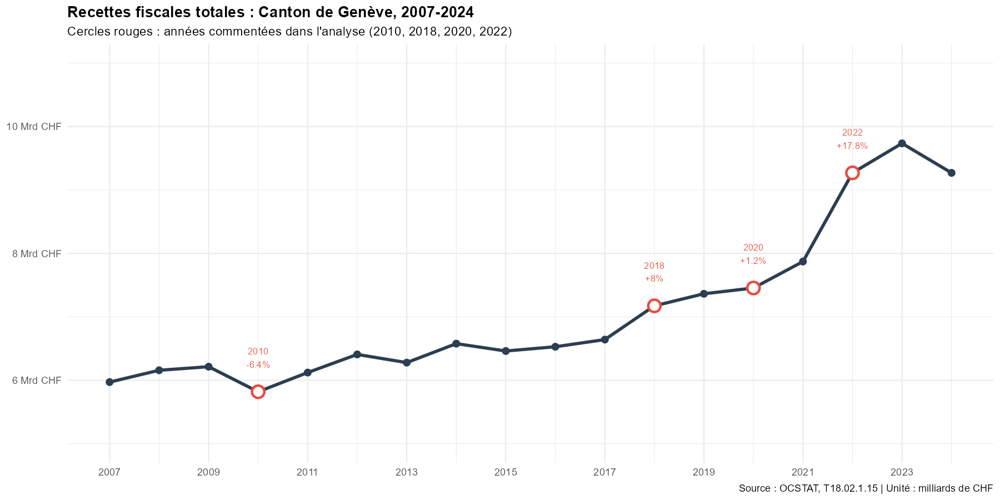

Les recettes fiscales genevoises passent de 5'971M CHF en 2007 à 9'269M CHF
en 2024, soit un TCAM de +2.62 %/an et une hausse totale de +3'298M.

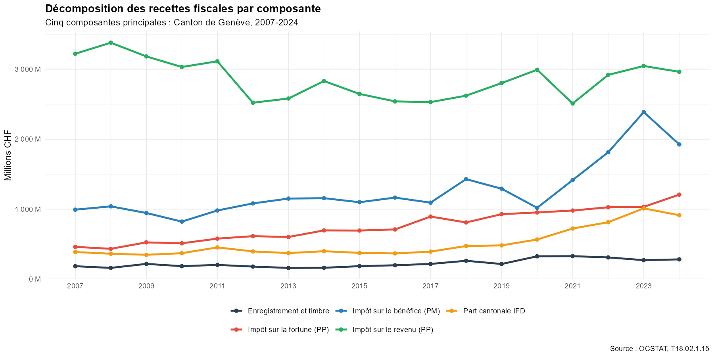

*Note : sur ce graphique, la baisse de l'IR en 2012 est l'artefact de
nomenclature décrit dans la section Données.*

**Qui porte la croissance ? Deux lectures complémentaires :**

| Composante | 2007 | 2024 | TCAM | Hausse en CHF | Part de la hausse |
|-----------|------|------|------|---------------|-------------------|
| Personnes physiques (total) | 3'700M | 5'171M | +1.99 %/an | +1'471M | 45 % |
| Personnes morales (total) | 1'246M | 2'108M | +3.14 %/an | +862M | 26 % |
| dont impôt sur le bénéfice | 993M | 1'925M | +3.97 %/an | +932M | |
| Part cantonale IFD | 387M | 913M | +5.18 %/an | +526M | 16 % |

En **pourcentage**, les impôts liés aux entreprises (bénéfice PM, IFD)
croissent nettement plus vite. En **francs**, ce sont les personnes physiques
qui contribuent le plus à la hausse. Genève reste plus exposée que d'autres
cantons aux cycles de bénéfices des grandes entreprises, mais sa base fiscale
repose d'abord sur les ménages.

**Années atypiques :**
- **2010 : -6.4 %**, contrecoup de la crise financière de 2008
- **2018 : +8.0 %**, hausse supérieure à la tendance
- **2020 : +1.2 %**, pas de baisse visible l'année du COVID
- **2022 : +17.8 %**, saut majeur (voir section 6)

**Volatilité relative des composantes (CV) :**

| Composante | CV | Lecture |
|-----------|-----|---------|
| IR | 9.7 % | Stable (mais affecté par la rupture de nomenclature) |
| PP total | 12.8 % | Stable |
| Bénéfice PM | 31.7 % | Volatile, suit les cycles de bénéfices |
| Fortune | 30.0 % | Volatile |
| Enreg. et timbre | 25.4 % | Modérément volatile |
| Successions | 37.8 % | Très volatile, pic en 2009 |
| IFD | 40.8 % | Très volatile |

Sept questions émergent de cette exploration ; elles structurent le script 02.

---

## 2. Tests statistiques (script 02)

### Q7 : pourquoi l'IR décroît-il ? (traitée en premier)

| Période | IR moyen |
|---------|---------|
| 2007-2011 (avec impôts à la source) | 3'186M |
| 2012-2024 (sans impôts à la source) | 2'731M |
| 2012-2024 (corrigé, avec impôts à la source) | 3'617M |

La baisse de l'IR est un artefact comptable. On travaille avec `pp_total`.

### Q1 : les séries sont-elles stationnaires ?

Une série non stationnaire (I(1)) dérive sans ancrage fixe. Modéliser deux
séries I(1) en niveaux produit facilement des **corrélations spurieuses**.
Avec N=18, aucun test isolé n'est fiable : on combine ADF, PP et KPSS,
complétés par Zivot-Andrews (rupture à date inconnue).

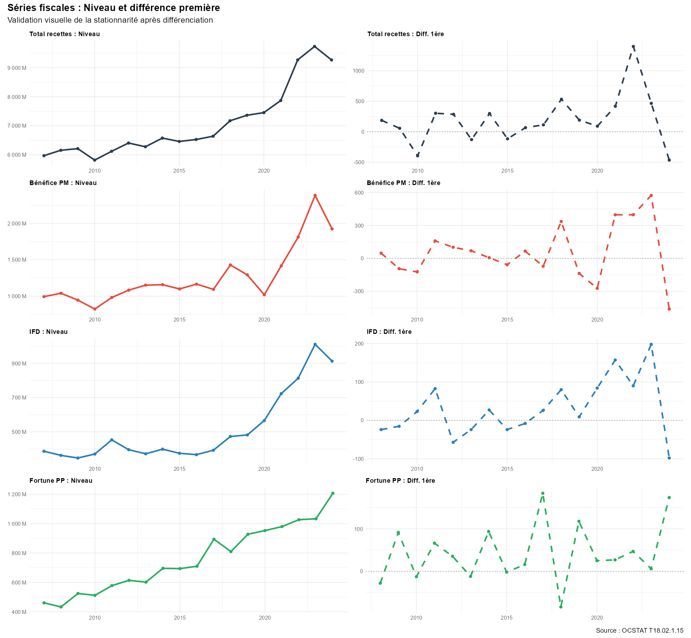

| Série | Conclusion |
|-------|-----------|
| Total recettes | I(1), confirmé par les trois tests |
| PP total | I(1), confirmé par les trois tests |
| Fortune PP | Traitée comme I(1) |
| IFD | I(1), KPSS confirme malgré un ADF ambigu |
| Bénéfice PM | Ambigu, traité comme I(1) |
| Enreg. et timbre | Ambigu |

**Zivot-Andrews** situe la rupture la plus probable en 2018 pour le total
et en 2019 pour le bénéfice PM. Conséquence : on modélise les variations
annuelles plutôt que les niveaux.

### Q2 : y a-t-il des ruptures structurelles ?

| Année testée | F-stat | p-value |
|-------------|--------|---------|
| 2010 | 4.197 | 0.037 |
| 2020 | 18.59 | ≈0 |
| 2022 | non testable (3 observations après) | |

*Prudence : le test de Chow est appliqué ici à une régression en niveaux sur
une série I(1), cadre dans lequel il rejette trop souvent. Le résultat de 2020
est d'ailleurs en tension avec la dummy COVID non significative (Q6). Ces tests
sont donc considérés comme **non concluants** et ne sont pas interprétés.*

### Q3 : l'outlier des successions en 2009

Les successions atteignent 308M en 2009 contre une médiane de 188M. Vu cette
volatilité (CV=37.8 %), la série n'est pas utilisée comme prédicteur.

### Q4 : les séries sont-elles cointégrées ?

Test de Johansen : le test de la trace suggère une cointégration, celui de la
valeur propre maximale ne la confirme pas. Par prudence : **VAR en différences**.

### Q5 : les corrélations sont-elles réelles ?

On compare les corrélations en niveaux et en variations annuelles.

| Variable | Corr. avec total (niveaux) | Corr. avec total (différences) |
|----------|---------------------------|--------------------------------|
| Fortune PP | 0.86 | 0.05 |
| Bénéfice PM | 0.89 | 0.71 |
| PIB genevois | 0.96 | 0.61 |
| IFD | 0.93 | 0.50 |
| SARON | -0.36 | 0.44 |

*La fortune PP est le cas le plus net : sa corrélation en niveaux est portée
par la tendance commune et devient quasi nulle en variations. Comme elle fait
partie du total, une partie de ce lien est aussi mécanique. Elle n'est pas
retenue comme prédicteur.*

### Q6 : les dummies

| Dummy | Définition | Coefficient | p-value | Décision |
|-------|-----------|-------------|---------|---------|
| dummy_rffa | =1 si année ≥ 2022 | +1'729M | ≈0 | Modélise le changement de niveau 2022+ |
| dummy_covid | =1 si année = 2020 | +153M | 0.61 | Non retenue |
| dummy_succ_2009 | =1 si année = 2009 | | | En réserve |

*Le coefficient de dummy_rffa (régression en niveaux avec tendance linéaire)
mesure l'écart moyen 2022-2024 par rapport à la tendance linéaire. C'est une
description, cohérente avec la section 6, pas un effet causal.*

*La dummy_covid non significative indique qu'aucune rupture n'est **détectable**
en 2020 ; avec N=18, cela ne prouve pas l'absence d'effet.*

---

## 3. Modèles (script 03)

On construit les modèles du plus simple au plus complexe ; un modèle plus
complexe doit apporter quelque chose pour être gardé.

**ARIMA(0,1,0) avec dérive** : la prévision de l'année suivante est la valeur
de l'année plus une croissance moyenne constante (194M/an).
RMSE = 391M | Ljung-Box p = 0.613

**ETS(M,N,N)** : alpha ≈ 1, la prévision est la dernière valeur observée,
sans tendance. RMSE = 434M

**ARIMAX(0,1,0) + dummy_rffa** : RMSE = 283M | Ljung-Box p = 0.748.
*Attention à la lecture :* une fois la série différenciée, la dummy en palier
agit comme une impulsion sur la seule année 2022. Son coefficient (+1'398M)
reproduit donc exactement la hausse observée en 2022, et la baisse du RMSE
(-27.7 %) vient mécaniquement de ce point parfaitement ajusté. La dummy indique
au modèle que le niveau a changé ; elle ne l'explique pas. Sans dérive, ce
modèle prolonge le dernier niveau à plat.

**VAR(1) en différences** : avec 14 observations effectives et 3 variables,
aucun coefficient n'est significatif. Présenté à titre exploratoire.

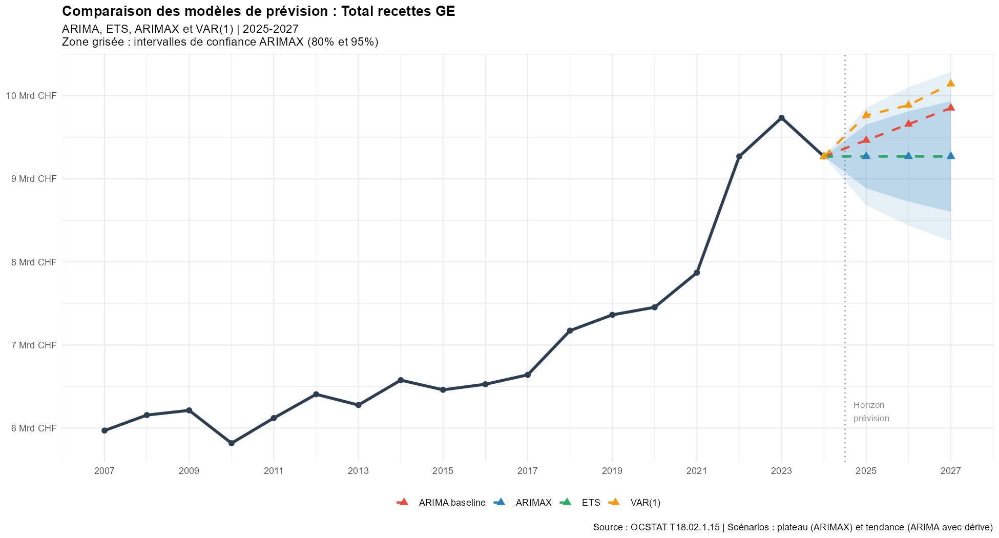

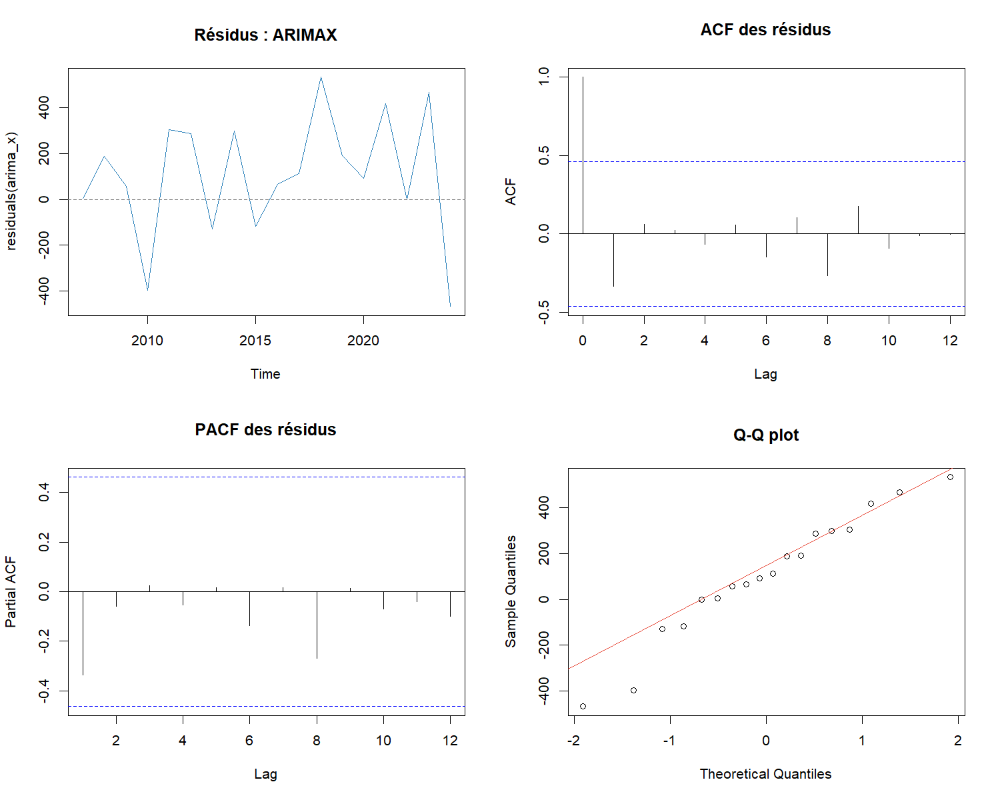

### Prévisions 2025-2027 : deux scénarios

Plutôt que de désigner un « meilleur » modèle, on présente deux hypothèses
qui encadrent l'incertitude :

| Année | Plateau (ARIMAX) | IC 95 % | Tendance (ARIMA + dérive) | IC 95 % |
|-------|------------------|---------|---------------------------|---------|
| 2025 | 9'269M | [8'681 ; 9'857] | 9'463M | [8'650 ; 10'276] |
| 2026 | 9'269M | [8'438 ; 10'100] | 9'657M | [8'507 ; 10'807] |
| 2027 | 9'269M | [8'251 ; 10'287] | 9'851M | [8'443 ; 11'259] |

- **Scénario plateau** : le niveau atteint après 2022 se maintient, sans croissance.
- **Scénario tendance** : les recettes reprennent leur croissance moyenne
  2007-2024 à partir du niveau 2024.

Les deux scénarios se recouvrent largement : avec N=18 et une rupture récente,
les données ne permettent pas de trancher. La baisse de 2024 rappelle aussi
qu'un retour partiel vers la tendance pré-2022 reste possible.

---

## 4. Analyse SHAP (script 04)

Un Random Forest, couplé aux valeurs SHAP, sert ici à **explorer** quelles
variables passées (t-1, t-2) accompagnent les variations des recettes. Il
n'est pas utilisé pour prévoir. Toutes les variables sont décalées dans le temps
pour éviter d'utiliser une information future.

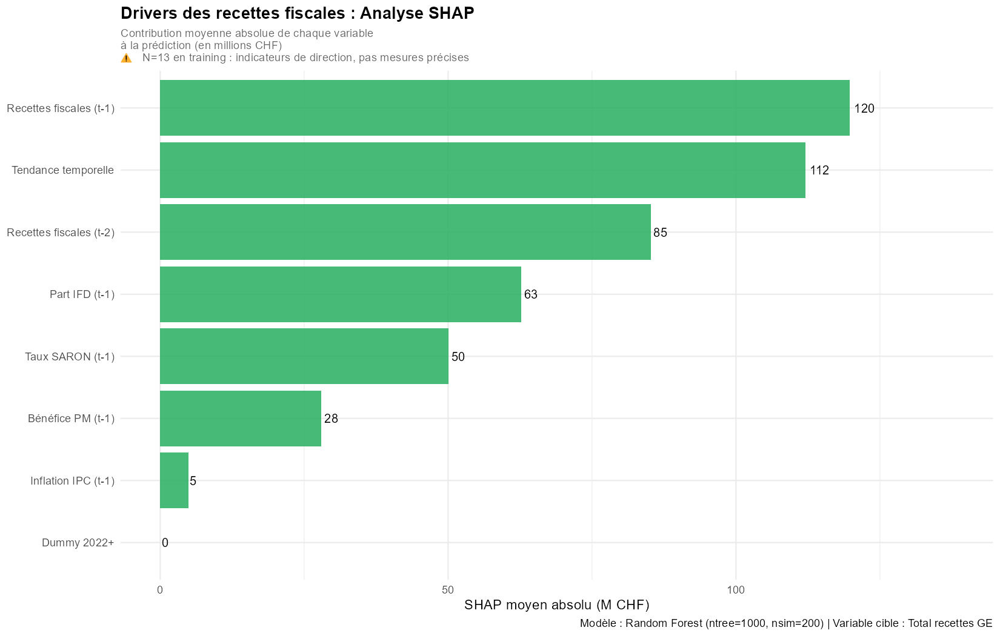

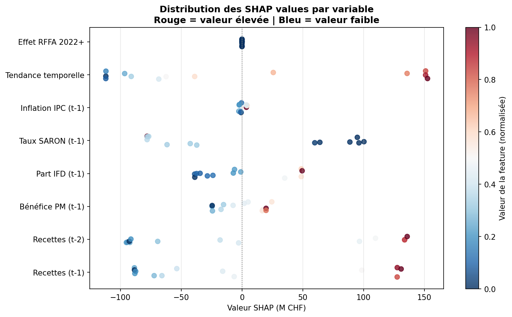

| Rang | Variable | SHAP moyen |
|------|----------|-----------|
| 1 | Recettes fiscales (t-1) | 120M |
| 2 | Tendance temporelle | 112M |
| 3 | Recettes fiscales (t-2) | 85M |
| 4 | Part IFD (t-1) | 63M |
| 5 | Taux SARON (t-1) | 50M |
| 6 | Bénéfice PM (t-1) | 28M |
| 7 | Inflation IPC (t-1) | 5M |
| 8 | Dummy 2022+ | 0M* |

*La dummy vaut 0 sur toute la période d'entraînement (2009-2021) : le modèle
ne peut pas apprendre son effet.*

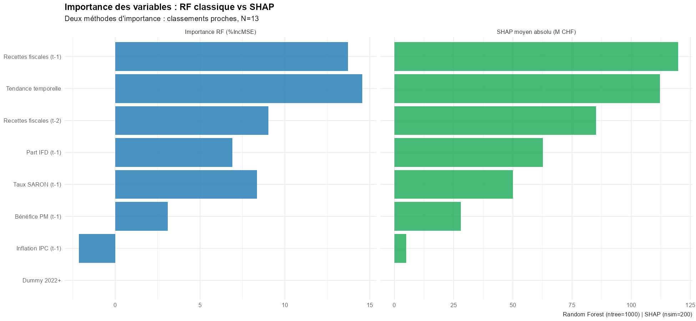

**Lecture prudente :** avec 13 observations d'entraînement, ces valeurs sont
des indications de direction, pas des mesures. Les deux méthodes d'importance
donnent un ordre proche, sans être identique. Le principal enseignement est
que les recettes passées et la tendance dominent : les recettes suivent
surtout leur propre inertie. Le rôle du SARON reste une hypothèse (signal
du cycle économique) que ces données ne permettent pas de vérifier.

---

## 5. Validation walk-forward (script 04b)

Les modèles de la section 3 avaient été évalués sur leurs données
d'entraînement. Le walk-forward corrige cela : on entraîne sur 2007-2016,
on prédit 2017, on ajoute 2017, on prédit 2018, et ainsi de suite jusqu'à 2024.

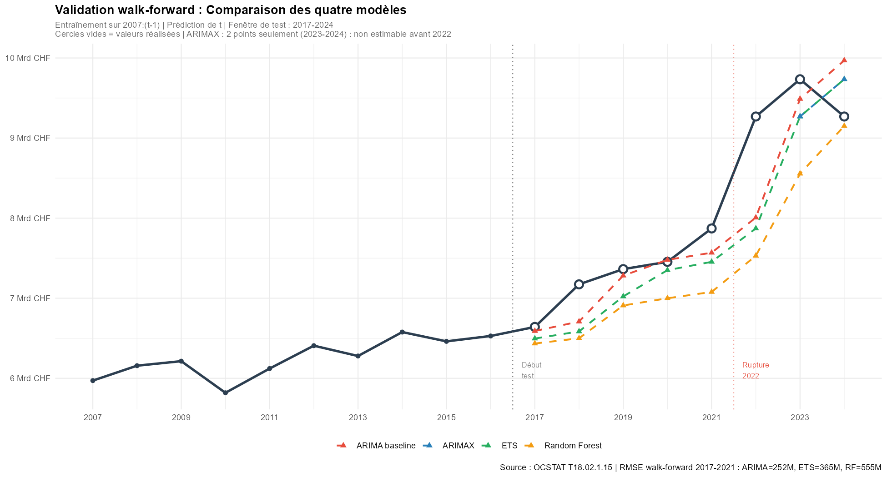

| Année | Réalisé | ARIMA | ETS | ARIMAX | RF |
|-------|---------|-------|-----|--------|----|
| 2017 | 6'641M | 6'590M | 6'496M | n/a† | 6'434M |
| 2018 | 7'173M | 6'708M | 6'585M | n/a† | 6'499M |
| 2019 | 7'363M | 7'282M | 7'022M | n/a† | 6'909M |
| 2020 | 7'454M | 7'479M | 7'350M | n/a† | 6'999M |
| 2021 | 7'871M | 7'568M | 7'454M | n/a† | 7'078M |
| 2022 | 9'269M | 8'007M | 7'871M | n/a† | 7'530M |
| 2023 | 9'734M | 9'489M | 9'269M | 9'269M | 8'555M |
| 2024 | 9'269M | 9'969M | 9'734M | 9'734M | 9'150M |

†La dummy vaut 0 sur tout l'entraînement avant 2023 : l'ARIMAX n'est pas
estimable. En 2023 et 2024, sa prévision est identique à celle de l'ETS
(dernière valeur observée).

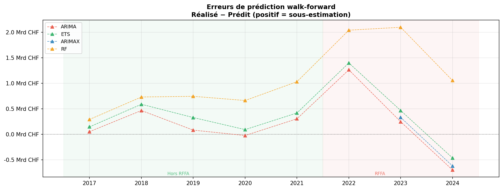

| Modèle | RMSE 2017-2024 | RMSE 2017-2021 |
|--------|---------------|----------------|
| ARIMA + dérive | 555M | **252M** |
| ETS | 618M | 365M |
| Random Forest | 864M | 555M |
| ARIMAX | 465M (2 années seulement) | n/a |

**Lecture :** en conditions normales (2017-2021), l'ARIMA avec dérive est le plus
précis. Le RMSE de l'ARIMAX ne porte que sur 2023-2024 et n'est pas comparable
aux autres. Toutes les grosses erreurs se concentrent sur 2022 : aucun modèle
fondé sur le passé ne pouvait anticiper ce saut.

---

## 6. Le surplus post-2022 (script 05)

Plutôt que d'attribuer un « effet » à une dummy, on mesure directement ce qui
s'est passé : **de combien les recettes 2022-2024 dépassent-elles la tendance
2007-2021 prolongée ?** On compare deux contrefactuels, pour montrer que le
résultat dépend du choix de tendance :

- **Tendance avec dérive** (marche aléatoire avec dérive, cohérente avec une série I(1))
- **Tendance linéaire** (régression sur les années 2007-2021)

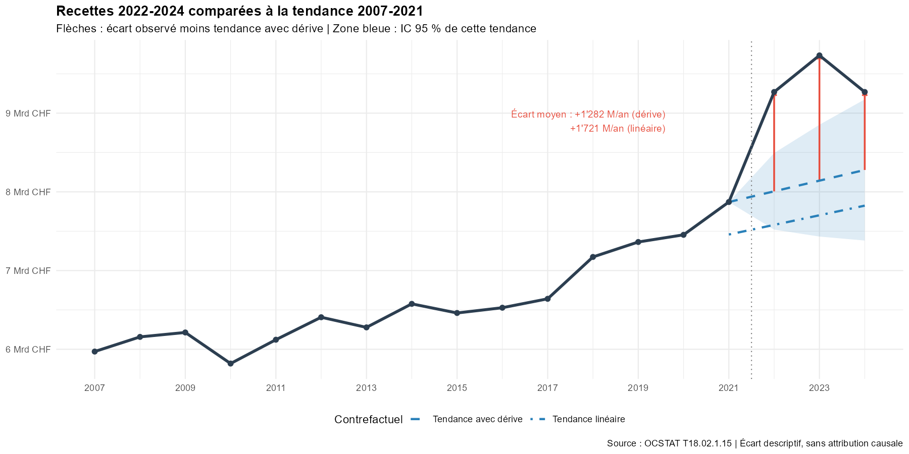

| Année | Observé | Tendance avec dérive | IC 95 % | Écart | Écart (tendance linéaire) |
|-------|---------|----------------------|---------|-------|---------------------------|
| 2022 | 9'269M | 8'007M | [7'520 ; 8'493] | +1'262M | +1'689M |
| 2023 | 9'734M | 8'142M | [7'432 ; 8'853] | +1'592M | +2'031M |
| 2024 | 9'269M | 8'278M | [7'381 ; 9'175] | +991M | +1'444M |

**Résultat : les recettes 2022-2024 dépassent la tendance passée de
+1.3 à +1.7 milliard CHF par an en moyenne**, selon le contrefactuel.
Les trois années se situent au-dessus de l'intervalle à 95 % de la tendance
avec dérive. L'écart se réduit en 2024.

### D'où vient ce surplus ?

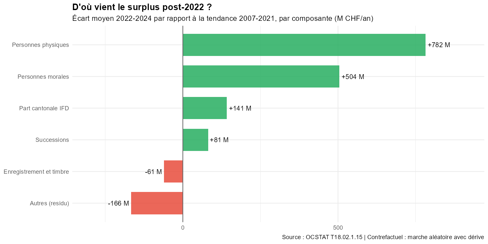

| Composante | Écart moyen (dérive) | Écart moyen (linéaire) | Part (dérive) |
|-----------|----------------------|------------------------|---------------|
| Personnes physiques | +782M | +764M | 61 % |
| Personnes morales | +504M | +555M | 39 % |
| Part cantonale IFD | +141M | +339M | 11 % |
| Successions | +81M | +87M | 6 % |
| Enregistrement et timbre | -61M | -2M | -5 % |
| Autres (résidu) | -166M | -21M | -13 % |

**Le surplus provient majoritairement des personnes physiques.** La RFFA, qui
porte sur l'imposition des entreprises, peut au mieux concerner la part des
personnes morales. Le poids des personnes physiques peut refléter d'autres
facteurs (revenus et marchés financiers de l'après-COVID, décalages de
taxation, impôts à la source) que ces données agrégées ne permettent pas
de distinguer.

---

## Ce que ce projet nous apprend

**1. Les recettes genevoises reposent d'abord sur les ménages, mais les
entreprises en font la dynamique.** Sur 2007-2024, les personnes physiques
représentent 45 % de la hausse en francs, les personnes morales 26 % et
l'IFD 16 %. Mais les impôts liés aux entreprises croissent deux fois plus
vite en pourcentage.

**2. Depuis 2022, les recettes dépassent leur tendance passée de 1.3 à 1.7
milliard CHF par an.** Ce surplus vient à environ 60 % des personnes
physiques. Il n'est pas attribuable à la RFFA sur la base de ces données.

**3. La fortune PP illustre le piège des corrélations en niveaux.** 0.86 en
niveaux, 0.05 en variations : le lien apparent est porté par la tendance commune.

**4. Aucune rupture n'est détectable en 2020.** Avec N=18, cela ne prouve pas
l'absence d'effet du COVID.

**5. Les recettes suivent surtout leur propre inertie.** Les recettes passées
dominent l'analyse SHAP, et l'ARIMA avec dérive est le modèle le plus précis
en conditions normales.

**6. Prévoir après une rupture reste très incertain.** Les scénarios
« plateau » et « tendance » pour 2025-2027 se recouvrent largement.

---

## Limitations

**Taille de l'échantillon (N=18).** Puissance des tests faible ; un test qui
ne rejette pas ne prouve rien.

**Données annuelles agrégées uniquement.** Pas de données par type de
contribuable, ce qui empêche toute attribution causale du surplus post-2022.

**Choix du contrefactuel.** Le surplus post-2022 dépend de la tendance retenue
(1.3 ou 1.7 milliard). Seulement 3 années sont observées après la rupture.

**SHAP instables.** 13 observations d'entraînement : indications de direction
uniquement.

**PIB disponible jusqu'en 2022 seulement.** Non utilisé comme régresseur de prévision.

---

## Améliorations possibles

**Avec de nouvelles données**
- Données trimestrielles (AFC, administration fiscale cantonale)
- Panel multi-cantonal (GE, ZH, VD, BS) pour isoler ce qui est propre à Genève
- Données désagrégées par type de contribuable, pour décomposer le surplus
- Masse salariale cantonale, taux de change EUR/CHF et USD/CHF

**Avec les données actuelles**
- Graphiques interactifs
- Mise à jour des notebooks Python sur la version révisée

---

## Reproductibilité

Ouvrir le dossier du dépôt comme projet RStudio (ou définir le répertoire de
travail à la racine du dépôt), puis :

```r
source("R/scripts/01_exploration.R")
source("R/scripts/02_tests.R")
source("R/scripts/03_modeles.R")
source("R/scripts/04_shap.R")
source("R/scripts/04b_walkforward.R")
source("R/scripts/05_surplus_post2022.R")   # nécessite le script 01 en mémoire
```

Les figures sont enregistrées dans `R/figures/`.

**Packages R requis :**
```r
install.packages(c("tidyverse", "tseries", "urca", "strucchange",
                   "forecast", "vars", "randomForest", "fastshap",
                   "patchwork", "scales"))
```

**Pipeline Python (première version, non révisée) :**
```bash
conda activate fiscal_ge
jupyter notebook
# Exécuter dans l'ordre : 01, 02, 03, 04, 04b
```

`set.seed(42)` dans tous les blocs avec composante aléatoire.

---

## Contact

**Frat DAG**  
Site : https://fratdag.ch  
LinkedIn : https://www.linkedin.com/in/fratdag/

---
---

# Geneva Tax Revenue: Analysis and Forecasting 2007-2024

**Author**: Frat DAG  
**First published**: April 2026 | **Revised**: September 2026  
**Data**: OCSTAT T18.02.1.15, FSO Regional Accounts, SNB data.snb.ch  
**Languages**: R 4.x + Python 3.11

---

## Revision Note (September 2026)

A critical review of the project revealed several interpretation errors in the
first version. They are corrected here, transparently:

1. **The "TRAF effect of +CHF 1,398M" was not an estimate.** In an ARIMA(0,1,0),
   a step dummy becomes, once the series is differenced, a one-year impulse.
   Its coefficient therefore exactly reproduces the observed 2022 increase
   (9,269M minus 7,871M). It is replaced by an explicit measure: the gap between
   observed revenues and the extended 2007-2021 trend (section 6).
2. **The "three independent methods" were not independent.** ARIMAX, BSTS and
   bootstrap relied on the same dummy and the same jump; the bootstrap also
   measured a different quantity (a gap in annual growth). Script 05
   (bootstrap + BSTS) is replaced by `05_surplus_post2022.R`.
3. **The post-2022 surplus comes mostly from individuals** (about 60%), not
   companies. Any causal attribution to TRAF, which concerns corporate
   taxation, is withdrawn.
4. **"Corporates drive growth" is qualified.** Corporate taxes grow faster in
   percentage terms, but individuals contribute more to the increase in francs.
5. **Forecasts are presented as a range of scenarios**, no longer as a single
   "retained model".

The Python notebooks have not yet been revised and reflect the first version.

---

## The Opening Question

Can we forecast the tax revenues of a Swiss canton using only public data?
And if so, what do the data actually tell us, and what can they not tell us?

The honest answer: **yes, partially, with important limitations that we
document along the way.** This README walks through each step of the analysis,
what we did, why, and what we would have done differently with better data.

---

## Context: TRAF and the 2022 Increase

The **Tax Reform and AHV Financing Act (TRAF)** is a **federal** reform that
came into force on 1 January 2020. It abolished the old privileged cantonal tax
statuses enjoyed by some companies and introduced new instruments (patent box,
R&D deductions). Each canton set its new corporate profit tax rate; Geneva
lowered it for ordinary companies.

Geneva hosts a high proportion of multinational headquarters, notably in
commodity trading and finance, so its corporate profit tax is sensitive to
the profits of these large firms.

**What the data show, and what they do not:** revenues jump +17.8% in 2022 and
then remain above their past trend. But the decomposition of this surplus
(section 6) shows that about 60% comes from **individuals**, who are not
affected by TRAF. TRAF is therefore context, not a demonstrated explanation.
With aggregated annual data, no causal attribution is possible.

Sources: FTA (estv.admin.ch), Canton of Geneva (ge.ch), OCSTAT (statistique.ge.ch)

---

## Glossary and Abbreviations

**Institutions and sources**
- **OCSTAT**: Geneva Cantonal Statistical Office
- **FSO**: Federal Statistical Office
- **SNB**: Swiss National Bank
- **FTA**: Federal Tax Administration

**Tax terms**
- **PIT**: personal income tax
- **Individuals (PP)**: individual taxpayers
- **Legal entities (PM)**: companies
- **DFT**: direct federal tax, collected by the Confederation, a share of which
  goes to the cantons
- **TRAF**: Tax Reform and AHV Financing Act (see Context)
- **enreg_timbre**: "Registration and stamp duty revenue" per OCSTAT nomenclature

**Economic terms**
- **GDP**: gross domestic product
- **SARON**: Swiss Average Rate Overnight, Swiss reference rate computed daily by the SNB
- **CAGR**: compound annual growth rate
- **CV**: coefficient of variation, a volatility measure in percent

**Statistical terms**
- **I(1)**: integrated of order 1, a series that drifts over time and becomes
  stationary once differenced
- **Stationarity**: stable mean and variance over time
- **Structural break**: sudden and lasting change in a series' behaviour
- **Dummy**: binary variable (1 if an event occurred, 0 otherwise)
- **Cointegration**: stable long-run relationship between I(1) series
- **Counterfactual**: the path the series would have followed if the past trend
  had continued; used as a benchmark
- **RMSE**: root mean square error; lower means more accurate
- **CI**: confidence interval

**Models**
- **ARIMA**: time series model based on past values and past errors
- **ARIMAX**: ARIMA with external variables (here the 2022+ dummy)
- **ETS**: exponential smoothing model (level, trend, seasonality)
- **VAR**: vector autoregression, models several series jointly

**Methods**
- **SHAP**: measures each variable's contribution to each prediction
- **Walk-forward**: validation that trains on the past and tests on the next
  year, moving forward one year at a time
- **ADF, PP, KPSS**: stationarity tests (KPSS tests the reverse hypothesis)

---

## Data: Why These Sources, Why These Choices

| Source | Series | Period | N |
|--------|--------|--------|---|
| OCSTAT T18.02.1.15 | Geneva tax revenues (20 items) | 2007-2024 | 18 |
| FSO Regional Accounts | Geneva nominal GDP | 2008-2022 | 15 |
| SNB data.snb.ch | SARON (monthly, aggregated to annual) | 2007-2024 | 18 |
| FSO via SNB | Swiss CPI (monthly, aggregated to annual) | 2007-2024 | 18 |

The main constraint is simple: **N=18 annual observations**. OCSTAT publishes
no quarterly or monthly data. With 18 observations, test power is low; a test
that "does not reject" does not prove the absence of a phenomenon.

**Why SARON?** The SNB policy rate in its current form only exists since 2019,
and LIBOR was discontinued. SARON covers the whole period.

**Why is GDP not a forecasting regressor?** FSO regional accounts stop in 2022:
one cannot forecast 2025-2027 with a variable whose recent values are unknown.

**Note on PIT nomenclature.** From 2012, OCSTAT separated withholding taxes from
income tax. PIT therefore appears to decline, but this is an accounting artefact.
We use `pp_total` (total taxes on individuals), consistent over the whole period.

---

## Approach Summary

**Inductive** approach: the data raise the questions, the questions determine
the tests, the tests determine the models.

1. Look at the data without preconceptions
2. Formally test what was observed
3. Build models from simplest to most complex
4. Explore which variables accompany the variation
5. Validate models on data they have not seen
6. Measure the post-2022 surplus relative to the past trend

---

## Project Structure

```
recettes-fiscales-genevoises/
├── README.md
├── R/
│   ├── scripts/
│   │   ├── 01_exploration.R
│   │   ├── 02_tests.R
│   │   ├── 03_modeles.R
│   │   ├── 04_shap.R
│   │   ├── 04b_walkforward.R
│   │   └── 05_surplus_post2022.R
│   └── figures/
│       ├── 01_total_evolution.png
│       ├── 01_decomposition.png
│       ├── 02_stationnarite_visuelle.png
│       ├── 03_comparaison_modeles.png
│       ├── 03_residus_modele_retenu.png
│       ├── 04_shap_importance.png
│       ├── 04_shap_beeswarm.png
│       ├── 04_shap_vs_rf_importance.png
│       ├── 04b_walkforward.png
│       ├── 04b_erreurs_walkforward.png
│       ├── 05_surplus_post2022.png
│       └── 05_decomposition_surplus.png
└── Python/
    ├── notebooks/        (first version, not revised)
    └── figures/          (_py suffix)
```

---

## 1. Exploration (script 01)


Geneva's tax revenues grow from CHF 5,971M in 2007 to CHF 9,269M in 2024,
a CAGR of +2.62%/year and a total increase of +CHF 3,298M.


*Note: on this chart, the 2012 drop in PIT is the nomenclature artefact
described in the Data section.*

**Who drives growth? Two complementary readings:**

| Component | 2007 | 2024 | CAGR | Increase (CHF) | Share of increase |
|-----------|------|------|------|----------------|-------------------|
| Individuals (total) | 3,700M | 5,171M | +1.99%/yr | +1,471M | 45% |
| Legal entities (total) | 1,246M | 2,108M | +3.14%/yr | +862M | 26% |
| of which profit tax | 993M | 1,925M | +3.97%/yr | +932M | |
| Cantonal share of DFT | 387M | 913M | +5.18%/yr | +526M | 16% |

In **percentage** terms, corporate-related taxes (profit tax, DFT) grow much
faster. In **francs**, individuals contribute most to the increase. Geneva is
more exposed than other cantons to large-firm profit cycles, but its tax base
rests first on households.

**Atypical years:**
- **2010: -6.4%**, aftershock of the 2008 financial crisis
- **2018: +8.0%**, above-trend increase
- **2020: +1.2%**, no visible drop in the COVID year
- **2022: +17.8%**, major jump (see section 6)

**Relative volatility by component (CV):**

| Component | CV | Reading |
|-----------|-----|---------|
| PIT | 9.7% | Stable (but affected by the nomenclature break) |
| Individuals total | 12.8% | Stable |
| Corporate profit tax | 31.7% | Volatile, follows profit cycles |
| Wealth tax | 30.0% | Volatile |
| Registration & stamp duties | 25.4% | Moderately volatile |
| Inheritance tax | 37.8% | Very volatile, 2009 spike |
| DFT | 40.8% | Very volatile |

Seven questions emerge from this exploration; they structure script 02.

---

## 2. Statistical Tests (script 02)

### Q7: Why does PIT decline? (addressed first)

| Period | Average PIT |
|--------|-------------|
| 2007-2011 (with withholding taxes) | CHF 3,186M |
| 2012-2024 (without withholding taxes) | CHF 2,731M |
| 2012-2024 (corrected, with withholding taxes) | CHF 3,617M |

The PIT decline is an accounting artefact. We work with `pp_total`.

### Q1: Are the series stationary?

A non-stationary (I(1)) series drifts without a fixed anchor. Modelling two I(1)
series in levels easily produces **spurious correlations**. With N=18, no single
test is reliable: we combine ADF, PP and KPSS, supplemented by Zivot-Andrews
(break at unknown date).


| Series | Conclusion |
|--------|-----------|
| Total revenues | I(1), confirmed by all three tests |
| Individuals total | I(1), confirmed by all three tests |
| Wealth tax | Treated as I(1) |
| DFT | I(1), KPSS confirms despite ambiguous ADF |
| Corporate profit tax | Ambiguous, treated as I(1) |
| Registration & stamp duties | Ambiguous |

**Zivot-Andrews** places the most likely break in 2018 for the total and in 2019
for corporate profit tax. Consequence: we model annual changes rather than levels.

### Q2: Are there structural breaks?

| Year tested | F-stat | p-value |
|-------------|--------|---------|
| 2010 | 4.197 | 0.037 |
| 2020 | 18.59 | ≈0 |
| 2022 | not testable (3 observations after) | |

*Caution: the Chow test is applied here to a levels regression on an I(1) series,
a setting in which it over-rejects. The 2020 result also conflicts with the
non-significant COVID dummy (Q6). These tests are therefore considered
**inconclusive** and are not interpreted.*

### Q3: The 2009 inheritance tax outlier

Inheritance tax reaches CHF 308M in 2009 against a median of CHF 188M. Given this
volatility (CV=37.8%), the series is not used as a predictor.

### Q4: Are the series cointegrated?

Johansen test: the trace test suggests cointegration, the maximum eigenvalue
test does not confirm it. As a precaution: **VAR in differences**.

### Q5: Are the correlations real?

We compare correlations in levels and in annual changes.

| Variable | Corr. with total (levels) | Corr. with total (differences) |
|----------|---------------------------|--------------------------------|
| Wealth tax | 0.86 | 0.05 |
| Corporate profit tax | 0.89 | 0.71 |
| Geneva GDP | 0.96 | 0.61 |
| DFT | 0.93 | 0.50 |
| SARON | -0.36 | 0.44 |

*Wealth tax is the clearest case: its correlation in levels is driven by the
common trend and becomes almost zero in changes. Since it is part of the total,
part of this link is also mechanical. It is not retained as a predictor.*

### Q6: The dummies

| Dummy | Definition | Coefficient | p-value | Decision |
|-------|-----------|-------------|---------|---------|
| dummy_rffa | =1 if year ≥ 2022 | +CHF 1,729M | ≈0 | Models the 2022+ level shift |
| dummy_covid | =1 if year = 2020 | +CHF 153M | 0.61 | Not retained |
| dummy_succ_2009 | =1 if year = 2009 | | | In reserve |

*The dummy_rffa coefficient (levels regression with a linear trend) measures the
average 2022-2024 gap relative to the linear trend. It is a description,
consistent with section 6, not a causal effect.*

*The non-significant dummy_covid indicates that no break is **detectable** in
2020; with N=18, this does not prove the absence of an effect.*

---

## 3. Models (script 03)

Models are built from simplest to most complex; a more complex model must add
something to be kept.

**ARIMA(0,1,0) with drift**: next year's forecast is this year's value plus a
constant average growth (CHF 194M/year). RMSE = 391M | Ljung-Box p = 0.613

**ETS(M,N,N)**: alpha ≈ 1, the forecast is the last observed value, without
trend. RMSE = 434M

**ARIMAX(0,1,0) + dummy_rffa**: RMSE = 283M | Ljung-Box p = 0.748.
*Read with care:* once the series is differenced, the step dummy acts as an
impulse on 2022 only. Its coefficient (+CHF 1,398M) therefore exactly
reproduces the observed 2022 increase, and the RMSE reduction (-27.7%)
mechanically comes from this perfectly fitted point. The dummy tells the model
that the level changed; it does not explain it. Without drift, this model
extends the last level flat.

**VAR(1) in differences**: with 14 effective observations and 3 variables, no
coefficient is significant. Presented as exploratory.


### Forecasts 2025-2027: two scenarios

Rather than naming a "best" model, we present two assumptions that frame
the uncertainty:

| Year | Plateau (ARIMAX) | 95% CI | Trend (ARIMA + drift) | 95% CI |
|------|------------------|--------|-----------------------|--------|
| 2025 | 9,269M | [8,681 ; 9,857] | 9,463M | [8,650 ; 10,276] |
| 2026 | 9,269M | [8,438 ; 10,100] | 9,657M | [8,507 ; 10,807] |
| 2027 | 9,269M | [8,251 ; 10,287] | 9,851M | [8,443 ; 11,259] |

- **Plateau scenario**: the post-2022 level holds, without growth.
- **Trend scenario**: revenues resume their 2007-2024 average growth from the
  2024 level.

The two scenarios overlap widely: with N=18 and a recent break, the data cannot
decide between them. The 2024 decline is also a reminder that a partial return
toward the pre-2022 trend remains possible.

---

## 4. SHAP Analysis (script 04)

A Random Forest combined with SHAP values is used here to **explore** which
past variables (t-1, t-2) accompany revenue changes. It is not used to forecast.
All variables are lagged to avoid using future information.


| Rank | Variable | Mean SHAP |
|------|----------|-----------|
| 1 | Tax revenues (t-1) | CHF 120M |
| 2 | Time trend | CHF 112M |
| 3 | Tax revenues (t-2) | CHF 85M |
| 4 | DFT share (t-1) | CHF 63M |
| 5 | SARON rate (t-1) | CHF 50M |
| 6 | Corporate profit tax (t-1) | CHF 28M |
| 7 | CPI inflation (t-1) | CHF 5M |
| 8 | 2022+ dummy | CHF 0M* |

*The dummy equals 0 over the whole training period (2009-2021): the model cannot
learn its effect.*


**Cautious reading:** with 13 training observations, these values are
directional indications, not measurements. The two importance methods give a
similar but not identical ranking. The main takeaway is that past revenues and
the trend dominate: revenues mostly follow their own inertia. The role of SARON
remains a hypothesis (a business-cycle signal) that these data cannot verify.

---

## 5. Walk-Forward Validation (script 04b)

The models in section 3 were evaluated on their training data. Walk-forward
fixes this: train on 2007-2016, predict 2017, add 2017, predict 2018, and so on
through 2024.


| Year | Actual | ARIMA | ETS | ARIMAX | RF |
|------|--------|-------|-----|--------|----|
| 2017 | 6,641M | 6,590M | 6,496M | n/a† | 6,434M |
| 2018 | 7,173M | 6,708M | 6,585M | n/a† | 6,499M |
| 2019 | 7,363M | 7,282M | 7,022M | n/a† | 6,909M |
| 2020 | 7,454M | 7,479M | 7,350M | n/a† | 6,999M |
| 2021 | 7,871M | 7,568M | 7,454M | n/a† | 7,078M |
| 2022 | 9,269M | 8,007M | 7,871M | n/a† | 7,530M |
| 2023 | 9,734M | 9,489M | 9,269M | 9,269M | 8,555M |
| 2024 | 9,269M | 9,969M | 9,734M | 9,734M | 9,150M |

†The dummy equals 0 over all training data before 2023: ARIMAX cannot be
estimated. In 2023 and 2024, its forecast equals that of ETS (last observed value).


| Model | RMSE 2017-2024 | RMSE 2017-2021 |
|-------|---------------|----------------|
| ARIMA + drift | 555M | **252M** |
| ETS | 618M | 365M |
| Random Forest | 864M | 555M |
| ARIMAX | 465M (2 years only) | n/a |

**Reading:** in normal conditions (2017-2021), ARIMA with drift is the most
accurate. The ARIMAX RMSE covers only 2023-2024 and is not comparable with the
others. All large errors concentrate on 2022: no model based on the past could
anticipate this jump.

---

## 6. The Post-2022 Surplus (script 05)

Rather than attributing an "effect" to a dummy, we directly measure what
happened: **by how much do 2022-2024 revenues exceed the extended 2007-2021
trend?** Two counterfactuals are compared, to show that the result depends on
the choice of trend:

- **Trend with drift** (random walk with drift, consistent with an I(1) series)
- **Linear trend** (regression on 2007-2021)


| Year | Actual | Trend with drift | 95% CI | Gap | Gap (linear trend) |
|------|--------|------------------|--------|-----|--------------------|
| 2022 | 9,269M | 8,007M | [7,520 ; 8,493] | +1,262M | +1,689M |
| 2023 | 9,734M | 8,142M | [7,432 ; 8,853] | +1,592M | +2,031M |
| 2024 | 9,269M | 8,278M | [7,381 ; 9,175] | +991M | +1,444M |

**Result: 2022-2024 revenues exceed the past trend by CHF 1.3 to 1.7 billion
per year on average**, depending on the counterfactual. All three years lie
above the 95% interval of the trend with drift. The gap narrows in 2024.

### Where does the surplus come from?


| Component | Average gap (drift) | Average gap (linear) | Share (drift) |
|-----------|---------------------|----------------------|---------------|
| Individuals | +782M | +764M | 61% |
| Legal entities | +504M | +555M | 39% |
| Cantonal share of DFT | +141M | +339M | 11% |
| Inheritance tax | +81M | +87M | 6% |
| Registration & stamp duties | -61M | -2M | -5% |
| Other (residual) | -166M | -21M | -13% |

**The surplus comes mostly from individuals.** TRAF, which concerns corporate
taxation, can at most relate to the legal-entity share. The weight of individuals
may reflect other factors (post-COVID incomes and financial markets, taxation
lags, withholding taxes) that these aggregated data cannot separate.

---

## What This Project Teaches Us

**1. Geneva's revenues rest first on households, but corporates set the pace.**
Over 2007-2024, individuals account for 45% of the increase in francs, legal
entities 26% and DFT 16%. But corporate-related taxes grow twice as fast in
percentage terms.

**2. Since 2022, revenues exceed their past trend by CHF 1.3 to 1.7 billion
per year.** About 60% of this surplus comes from individuals. It cannot be
attributed to TRAF on the basis of these data.

**3. Wealth tax illustrates the levels-correlation trap.** 0.86 in levels, 0.05
in changes: the apparent link is driven by the common trend.

**4. No break is detectable in 2020.** With N=18, this does not prove COVID
had no effect.

**5. Revenues mostly follow their own inertia.** Past revenues dominate the SHAP
analysis, and ARIMA with drift is the most accurate model in normal conditions.

**6. Forecasting after a break remains highly uncertain.** The "plateau" and
"trend" scenarios for 2025-2027 overlap widely.

---

## Limitations

**Sample size (N=18).** Low test power; a test that does not reject proves nothing.

**Aggregated annual data only.** No data by taxpayer type, which prevents any
causal attribution of the post-2022 surplus.

**Choice of counterfactual.** The post-2022 surplus depends on the chosen trend
(1.3 or 1.7 billion). Only 3 years are observed after the break.

**Unstable SHAP values.** 13 training observations: directional indications only.

**GDP available only through 2022.** Not used as a forecasting regressor.

---

## Possible Improvements

**With new data**
- Quarterly data (FTA, cantonal tax administration)
- Multi-cantonal panel (GE, ZH, VD, BS) to isolate what is specific to Geneva
- Data disaggregated by taxpayer type, to decompose the surplus
- Cantonal wage bill, EUR/CHF and USD/CHF exchange rates

**With current data**
- Interactive charts
- Update of the Python notebooks to the revised version

---

## Reproducibility

Open the repository folder as an RStudio project (or set the working directory
to the repository root), then:

```r
source("R/scripts/01_exploration.R")
source("R/scripts/02_tests.R")
source("R/scripts/03_modeles.R")
source("R/scripts/04_shap.R")
source("R/scripts/04b_walkforward.R")
source("R/scripts/05_surplus_post2022.R")   # requires script 01 in memory
```

Figures are saved in `R/figures/`.

**Required R packages:**
```r
install.packages(c("tidyverse", "tseries", "urca", "strucchange",
                   "forecast", "vars", "randomForest", "fastshap",
                   "patchwork", "scales"))
```

**Python pipeline (first version, not revised):**
```bash
conda activate fiscal_ge
jupyter notebook
# Run in order: 01, 02, 03, 04, 04b
```

`set.seed(42)` in all blocks with a random component.

---

## Contact

**Frat DAG**  
Website: https://fratdag.ch  
LinkedIn: https://www.linkedin.com/in/fratdag/
